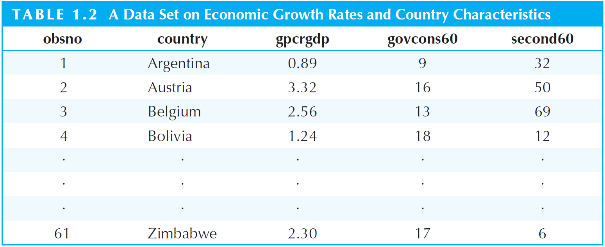
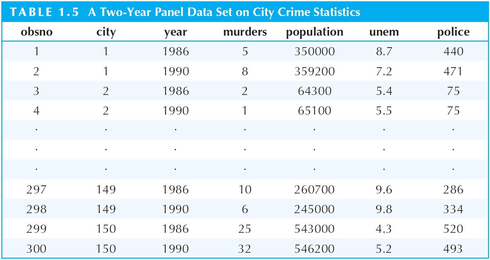

```{r setup, include = F}
# This is the recommended set up for flipbooks
# you might think about setting cache to TRUE as you gain practice --- building flipbooks from scratch can be time consuming
options(width = 70)
knitr::opts_chunk$set(
  dev.args = list(bg = 'transparent'),
  fig.width = 12, message = TRUE,
  warning = FALSE, comment = "", cache = TRUE, fig.retina = 3
)
knitr::opts_knit$set(global.par = TRUE)
Sys.setenv(`_R_S3_METHOD_REGISTRATION_NOTE_OVERWRITES_` = "false")
# remotes::install_github("luukvdmeer/sfnetworks")
# remotes::install_github("EvaMaeRey/flipbookr")
# remotes::install_github("rlesur/klippy")
# devtools::install_github("gadenbuie/xaringanExtra")
library(flipbookr)
library(xaringanthemer)
library(tidyverse)
library(klippy)
library(xaringanExtra)
library(gt); library(knitr); library(kableExtra); library(tibble)
library(summarytools); library(qrcode)
#.my-logo-right {
#content: "";
#    position: absolute;
#    left: 400px;
#    height: 400px;
#    width: 400px;
#    background-repeat: no-repeat;
#    background-size: contain;
#    background-image: url("qr.png");
#}
#<div class="my-logo-right"></div>
```

<style>
.notbold{
    font-weight:normal
}

body {
text-align: justify;
}

h1{
      margin-top: -1px;
      margin-bottom: -3px;
}

.small-code pre{
  margin-bottom: -10px;
  
}  

.medium-code pre{
  margin-bottom: 2px;
  
}

p.comment {
background-color: #E1E1FF;
padding: 10px;
border: 1px solid white;
margin-left: 25px;
border-radius: 15px;
text-align: center;
}
</style>

```{r xaringan-scribble, echo=FALSE}
xaringanExtra::use_scribble()
```

```{r xaringanExtra-clipboard, echo=FALSE}
htmltools::tagList(
  xaringanExtra::use_clipboard(
    button_text = "<i class=\"fa fa-clipboard\"></i>",
    success_text = "<i class=\"fa fa-check\" style=\"color: #90BE6D\"></i>",
    error_text = "<i class=\"fa fa-times-circle\" style=\"color: #F94144\"></i>"
  ),
  rmarkdown::html_dependency_font_awesome()
)
```

```{r xaringan-extra-styles, echo=FALSE}
xaringanExtra::use_extra_styles(
  hover_code_line = TRUE,         #<<
  mute_unhighlighted_code = TRUE  #<<
)
```

<font size = "5">

<br>
<br>
<br>
<br>
<br>
Link slides en formato [html](https://gusgarciacruz.github.io/EconometriaMEA/Tema1/Tema1.html)

Link slides en formato [PDF](https://gusgarciacruz.github.io/EconometriaMEA/Tema1/Tema1.pdf)

---
# <span style="font-size:80%">En este tema</span>

- <span style="font-size:150%">[<span style="color:black">La estructura de los datos económicos](#estructura)</span> <br> <br>

- <span style="font-size:150%">[<span style="color:black">Datos de sección cruzada (*Cross-sectional data*)](#sc)</span> <br> <br>

- <span style="font-size:150%">[<span style="color:black">Datos de series de tiempo (*Time series data*)](#st)</span> <br> <br>

- <span style="font-size:150%">[<span style="color:black">Datos panel o longitudinales (*Panel data*)](#pd)</span> 

---
name: estructura
# <span style="font-size:80%">La estructura de los datos económicos</span>
<font size = "5">

- El conjunto de datos en economía son de una variedad de tipos

- En general los métodos econométricos pueden ser aplicados con pocas modificaciones para diferentes tipos de datos

- Sin embargo, las características especiales de algunos conjuntos de datos deben ser tenidos en cuenta para ser explotados

- Entre las más importantes estructuras de datos se tienen:
	- Datos de sección cruzada (*Cross-sectional data*)
	
	- Datos de series de tiempo (*Time series data*)
	
	- Datos panel o longitudinales (*Panel data*)
	
---
name: sc
# <span style="font-size:80%">Datos de sección cruzada</span>
<font size = "5">

- **Definición**: un conjunto de datos de sección cruzada consiste en una muestra de individuos, hogares, firmas, ciudades, estados, países, o variedad de otras unidades <span style="color:blue">tomadas en un dado punto en el tiempo</span>

- Una importante característica de los datos de sección cruzada es que se asume que estos datos han sido obtenidos de una <span style="color:blue">muestra aleatoria</span> de una población objetivo. Por ejemplo: salarios, educación, experiencia y otras características de la población

- Los datos de sección cruzada son ampliamente utilizadas en economía y otras ciencias sociales

- En economía el análisis de estos tipos de datos está cercanamente alineado con el campo de la microeconomía aplicada: economía laboral, organización industrial, economía urbana, economía de la educación, economía de la salud, etc

- Datos sobre individuos, hogares, firmas, y ciudades en un punto en el tiempo son importantes para probar hipótesis en la microeconomía y evaluar políticas económicas

---
# <span style="font-size:80%">Datos de sección cruzada</span>

```{r}
library(haven) # Leyendo el paquete haven para leer datos de Stata
data1 <- read_dta("http://fmwww.bc.edu/ec-p/data/wooldridge/wage1.dta")
names(data1) # Muestra las variables que contiene la base de datos
```

<span style="font-size:100%">En este [link](http://fmwww.bc.edu/ec-p/data/wooldridge/wage1.des) se puede ver la descripción de las variables (es lo que llamamos el diccionario de variables)</span>

<p style="margin-bottom: -1em">

.pull-left-50[
```{r}
data1[1:15,c("wage", "educ", "exper", "female", "married")]
```
]

.pull-right-50[
```{r}
data1[512:526,c("wage", "educ", "exper", "female", "married")]
```
]


---
# <span style="font-size:80%">Datos de sección cruzada</span>
<font size = "5">

- Diferentes variables algunas veces corresponden a diferentes períodos de tiempo en datos de sección cruzada

- Por ejemplo, para determinar <span style="color:blue">los efectos de las políticas sobre el crecimiento de largo plazo</span>, se ha estudiado la relación entre el <span style="color:blue">crecimiento en el PIB per capita real</span> sobre un cierto período (1960-1985) y variables determinadas en parte por <span style="color:blue">políticas en 1960</span>, como <span style="color:blue">consumo del gobierno</span> como porcentaje del PIB y <span style="color:blue">las tasas de adultos con secundaria</span> 	

```{r, echo=FALSE, out.width="70%",fig.align='center'}

```

---
name: st
# <span style="font-size:80%">Datos de series de tiempo</span>
<font size = "5">

- **Definición**: los datos de series de tiempo consiste de observaciones sobre una o varias variables sobre el tiempo

- Ejemplos: los precios, la oferta monetaria, IPC, PIB, tasas de homicidios, etc

- A diferencia del los datos de sección cruzada, el orden cronológico de las observaciones en los datos de series de tiempo conlleva a potencialmente importante información

- Dos características importantes en los datos de series de tiempo son la <span style="color:blue">dependencia temporal</span> y la presencia de <span style="color:blue">tendencias sobre el tiempo</span>. Estos factores deben ser tenidos en cuenta antes aplicar técnicas econométricas estándar

- Otra característica a tener en cuenta en este tipo de datos es la <span style="color:blue">frecuencia de los datos</span>: datos diarios, semanales, mensuales, trimestrales o anuales. Este tipo de datos presentan fuertes patrones estacionales, lo cual debe ser tenido en cuenta en los modelos de regresión  

---
# <span style="font-size:80%">Datos de series de tiempo</span>
<span style="font-size:100%">
Datos anuales de Puerto Rico entre 1950 y 1987 sobre la tasa de empleo, salario mínimo y otras variables usadas en Castillo-Freeman y Freeman (1992) para estudiar los efectos del salario mínimo sobre el empleo

```{r}
data2 <- read_dta("http://fmwww.bc.edu/ec-p/data/wooldridge/prminwge.dta")
names(data2)
```

En este [link](http://fmwww.bc.edu/ec-p/data/wooldridge/prminwge.des) se puede ver la descripción de las variables

<p style="margin-bottom: -1em">

.pull-left-50[
```{r}
data2[1:15,c("year","prepop", "usgnp", "mincov")]
```
]

.pull-right-50[
```{r}
data2[24:38,c("year","prepop", "usgnp", "mincov")]
```
]

---
name: dp
# <span style="font-size:80%">Datos panel o longitudinales</span>
<font size = "5">

- **Definición**: los datos panel o longitudinales consisten en series de tiempo para unidad de sección cruzada

- Ejemplo: información sobre salarios, educación y empleo para un conjunto de individuos sobre un período de 10 años. O datos de crimen de dos años para 150 ciudades

```{r, echo=FALSE, out.width="70%",fig.align='center'}

```

---
# <span style="font-size:80%">Datos panel o longitudinales</span>
<font size = "5">

Los datos panel presentan importantes ventajas sobre los datos de sección cruzada:
- la existencia de múltiples observaciones sobre la misma unidad permite controlar por <span style="color:blue">características inobservadas</span> de los individuos, firmas, etc

- permiten estudiar la importancia de los efectos de <span style="color:blue">los rezagos</span>. Esto es de particular importancia teniendo en cuenta que muchas medidas de política puede ser esperadas a tener un impacto después de un tiempo
