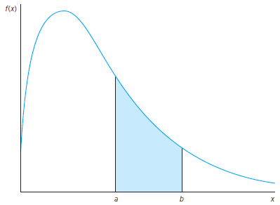

```{r setup, include = F}
# This is the recommended set up for flipbooks
# you might think about setting cache to TRUE as you gain practice --- building flipbooks from scratch can be time consuming
options(width = 70)
knitr::opts_chunk$set(
  dev.args = list(bg = 'transparent'),
  fig.width = 12, message = TRUE,
  warning = FALSE, comment = "", cache = TRUE, fig.retina = 3
)
knitr::opts_knit$set(global.par = TRUE)
Sys.setenv(`_R_S3_METHOD_REGISTRATION_NOTE_OVERWRITES_` = "false")
# remotes::install_github("luukvdmeer/sfnetworks")
# remotes::install_github("EvaMaeRey/flipbookr")
# remotes::install_github("rlesur/klippy")
# devtools::install_github("gadenbuie/xaringanExtra")
library(flipbookr)
library(xaringanthemer)
library(tidyverse)
library(klippy)
library(xaringanExtra)
library(gt); library(knitr); library(kableExtra); library(tibble)
library(summarytools); library(qrcode)
```

<style>
.notbold{
    font-weight:normal
}

body {
text-align: justify;
}

h1{
      margin-top: -1px;
      margin-bottom: -3px;
}

.small-code pre{
  margin-bottom: -10px;
  
}  

.medium-code pre{
  margin-bottom: 2px;
  
}

p.comment {
background-color: #E1E1FF;
padding: 10px;
border: 1px solid white;
margin-left: 25px;
border-radius: 15px;
text-align: center;
}
</style>

```{r xaringan-scribble, echo=FALSE}
xaringanExtra::use_scribble()
```

```{r xaringanExtra-clipboard, echo=FALSE}
htmltools::tagList(
  xaringanExtra::use_clipboard(
    button_text = "<i class=\"fa fa-clipboard\"></i>",
    success_text = "<i class=\"fa fa-check\" style=\"color: #90BE6D\"></i>",
    error_text = "<i class=\"fa fa-times-circle\" style=\"color: #F94144\"></i>"
  ),
  rmarkdown::html_dependency_font_awesome()
)
```

```{r xaringan-extra-styles, echo=FALSE}
xaringanExtra::use_extra_styles(
  hover_code_line = TRUE,         #<<
  mute_unhighlighted_code = TRUE  #<<
)
```

<font size = "5">

<br>
<br>
<br>
<br>
<br>
Link slides en formato [html](https://gusgarciacruz.github.io/EconometriaMEA/Tema2/Tema2.html)

Link slides en formato [PDF](https://gusgarciacruz.github.io/EconometriaMEA/Tema2/Tema2.pdf)

---
# <span style="font-size:80%">En este tema</span>

- <span style="font-size:150%">[<span style="color:black">Motivación](#motivacion)</span> <br> <br>

- <span style="font-size:150%">[<span style="color:black">Variables aleatorias y sus distribuciones de probabilidad](#va)</span> <br> <br>

- <span style="font-size:150%">[<span style="color:black">Tipos de variables aleatorias](#tva)</span> <br> <br>

- <span style="font-size:150%">[<span style="color:black">Características de las distribuciones de probabilidad](#distribucion)</span> <br> <br>

- <span style="font-size:150%">[<span style="color:black">Medidas de asociación](#ma)</span>

---
# <span style="font-size:80%">Lecturas</span>
<font size = "5">

- Wooldridge, Jeffrey (2013). *Introducción a la econometría*. 5a edición, Cengage Learning. <span style="color:blue">Apéndice B</span>

- Gujarati, D. y Porter, D. (2010). *Econometría*. 5a edición, Mc Graw Hill. <span style="color:blue">Apéndice A</span>

---
name: motivacion
# <span style="font-size:80%">Motivación</span>
<font size = "5">

El análisis de probabilidad de una variable aleatoria ayuda a encontrar soluciones a diferentes situaciones

Por ejemplo, el caso de una aerolínea que tiene que decidir <span style="color:blue">cuántas reservas aceptar</span> para un vuelo en el que hay <span style="color:blue">100 asientos disponibles</span>. Existen diferentes situaciones que hacen el problema no trivial:


- Si hay pocas reservas, todas serán aceptadas
	
- Pero <span style="color:blue">¿qué pasa si hay muchas personas reservando, más de 100?</span>
	<p style="margin-bottom: -0.8em">
	- aceptar máximo 100. Pero si hay personas que cancelan se corre el riesgo de <span style="color:blue">no llenar el avión</span>
	- aceptar más de 100. Habrá un exceso de reservas y tendrá que <span style="color:blue">compensar a los pasajeros</span>
	
<p style="margin-bottom: 1.5em">
	
<p class="comment">
¿Se puede determinar la cantidad óptima de reservar que deba hacer la aerolínea?
</p>

---
name: va
# <span style="font-size:80%">Variables aleatorias y sus distribuciones de probabilidad</span>
<font size = "5">

- Entender el concepto de variable aleatoria es muy importante en economía y en general en las ciencias sociales $\Longrightarrow$ <span style="color:blue">todo el tiempo los economistas estamos trabajando con variables aleatorias</span>

- La variable <span style="color:blue"> $X$: el número de reservas que recibe la aerolínea</span>, es una variable aleatoria ya que, hasta que los datos son observados, es incierto que valores tomará $X$

- Una <span style="color:blue">variable aleatoria</span> es aquella que toma un valor numérico que será determinado por un <span style="color:blue">experimento</span>

- <span style="color:blue">Un experimento</span>, en general, es un procedimiento que puede repetirse una cantidad infinita de veces y que tiene un conjunto bien definido de resultados

---
# <span style="font-size:80%">Variables aleatorias y sus distribuciones de probabilidad</span>
<font size = "5">

- Por ejemplo, <span style="color:blue">el número de reservas que recibe la aerolínea</span> es una variable aleatoria y es importante ya que es crucial determinar el <span style="color:blue">óptimo de reservas que debe aceptar la aerolínea</span>

- El número de reservas que recibe la aerolínea es una variable aleatoria ya que 
<p style="margin-bottom: -0.8em">
 - en cada vuelo el número de reservas es <span style="color:blue">incierto</span>, no se sabe cuantas finalmente se van hacer
<p style="margin-bottom: -0.8em"> 
 - el número de reservas puede pensarse como un <span style="color:blue">resultado de un experimento</span>, esto es, se puede <span style="color:blue">repetir una cantidad infinita de veces</span> (cada vez que haya un vuelo) y tiene un <span style="color:blue">conjunto bien definido de resultados</span> (de cero reservas al óptimo definido por la aerolínea)   
 
- <span style="color:blue">Problema de información incompleta</span>: el hecho de que la aerolínea entienda que el número de reservas es una variable aleatoria hace que el problema de estimar el número (óptimo) de reservas no sea trivial

---
# <span style="font-size:80%">Variables aleatorias y sus distribuciones de probabilidad</span>
<font size = "5">

<p class="comment">
¿Se puede determinar la cantidad óptima de reservas que debe aceptar la aerolínea?
</p>

- Dada cierta información, por ejemplo <span style="color:blue">la probabilidad con la que en cada vuelo se aceptan un número fijo de reservas (ej. 100)</span>, puede emplearse la <span style="color:blue">probabilidad</span> básica para encontrar la solución a este caso

- En otras palabras, se puede construir <span style="color:blue">la distribución de probabilidad</span> de la variable aleatoria <span style="color:blue">número de reservas</span> con la información pasada de esta variable

- Este procedimiento permite con información ex-ante pronosticar el posible número de reservas

---
# <span style="font-size:80%">Variables aleatorias y sus distribuciones de probabilidad</span>

<p style="margin-bottom: -1em">
```{r}
library(summarytools)
x <- rnorm(400,100)
x <- round(x, digits = 0)
freq(x, headings=F)
```

<p style="margin-bottom: -1em">

.pull-left-50[
```{r out.width="80%",fig.align='center'}
hist(x, breaks = c(96,97,98,99,100,101,102,103), xlab="Número de reservas",
     ylab="Frecuencia", ylim=c(0,100), main="Distribución de frecuencia",col="blue")
```
]

.pull-right-50[
```{r out.width="80%",fig.align='center'}
hist(x, freq=F, breaks = c(96,97,98,99,100,101,102,103), xlab="Número de reservas",
     ylab="Probabilidad (Densidad)", main="Distribución de probabilidad",col="grey")
```
]

---
# <span style="font-size:80%">Variables aleatorias y sus distribuciones de probabilidad</span>
<font size = "5">

Otras variables aleatorias importantes

- <span style="color:blue">Hogar</span>: ingreso anual del hogar, tamaño del hogar, tasa de participación laboral del hogar

- <span style="color:blue">País</span>: número de pensionados, número de individuos bajo la línea de pobreza, precio del petróleo, precio del dólar, tasa de homicidio, tasa de desempleo

- <span style="color:blue">Firma</span>: costo de producción, insumos utilizados, número de empleados

- <span style="color:blue">Otras menos importantes</span>: cantidad de caras en 10 lanzamientos, la cantidad de veces que cae el 6 al tirar un dado, número de penaltis acertados cobrados por Messi

---
name: tva
# <span style="font-size:80%">Tipos de variables aleatorias</span>
.small-code[
<p style="margin-bottom: -1em">
**<span style="color:blue">Discretas</span>**
<p style="margin-bottom: -1em">
- Es una variable que sólo toma una cantidad finita de valores
<p style="margin-bottom: -0.5em">
- Ejemplos: variable aleatoria Bernoulli (o binaria, toma valores 0 o 1); estar desempleado o no; estar enfermo o no 
<p style="margin-bottom: -0.5em">

```{r out.width="50%",fig.align='center'}
x <- rbinom(100, 1, 0.75)
freq(x, h=F, cumul=F)
hist(x, freq=F, xlim=c(0,1), ylim=c(0,8), xlab="Bernoulli", ylab="Probabilidad", main="", col="skyblue")
```
]

---
# <span style="font-size:80%">Tipos de variables aleatorias</span>

**<span style="color:blue">Discretas</span>**
<p style="margin-bottom: -1em">

- Para describir por completo el comportamiento de una variable aleatoria discreta es necesario determinar la <span style="color:blue">probabilidad</span> que toma cada valor de la variable

- En el ejemplo de número de reservas óptimo por la aerolínea, el problema puede analizarse en el contexto de las variables aleatorias de Bernoulli de la siguiente forma: <span style="color:blue">dada una reserva realizada por una persona, tomado aleatoriamente, se define una variable aleatoria de Bernoulli como $X=1$ si la aerolínea ha tomado la reserva y $X=0$ si no la ha tomado

- La probabilidad de que una reserva haya sido tomada por la aerolínea puede ser cualquier numero entre cero y uno. Si llamamos a esta probabilidad $\theta$, se tienen las siguientes probabilidades:

$$P(X=1) = \theta$$
$$P(X=0) = 1-\theta$$


- De manera general, cualquier va aleatoria discreta queda completamente explicada cuando se determinan las probabilidades de cada valor que toma:

$$p_{j}=P(X=x_{j}), j=1,2,...,k$$

donde cada $p_{j}$ está entre 0 y 1 y

$$p_{1}+p_{2}+...+p_{k}=1$$

---
# <span style="font-size:80%">Tipos de variables aleatorias</span>
<font size = "5">
**<span style="color:blue">Discretas</span>**
<p style="margin-bottom: -1em">

- La <span style="color:blue">función de densidad de probabilidad (fdp)</span> de $X$ resume la información concerniente a los valores que puede tomar $X$ y a sus correspondientes probabilidades:

$$f(x_{j})=p_{j}, j=1,2,...,k$$

- Dada la fdp de cualquier variable aleatoria discreta, es fácil calcular la probabilidad de cualquier evento relacionado con esa variable aleatoria

- Por ejemplo, suponga que $X$ es la cantidad de tiros libres anotados por Messi en dos intentos, entonces $X$ puede tomar los valores { $0,1,2$}. Suponga que la fdp de $X$ está definida por:

$$f(0)=.17; f(1)=.50; f(2)=.33$$

---
# <span style="font-size:80%">Tipos de variables aleatorias</span>
<font size = "5">
**<span style="color:blue">Discretas</span>**
<p style="margin-bottom: -1em">
.pull-left-50[
```{r}
set.seed(123456789)
x <- rbinom(100, 2, 0.6)
freq(x, h=F, cumul=F)

```
]

.pull-right-50[
```{r out.width="90%",fig.align='center'}
hist(x, freq=F, breaks=c(-1,0,1,2), xlab="Cantidad de tiros libres anotados por Messi", ylab="Probabilidad", main="fdp de la cantidad de tiros 
     libres marcados por Messi en dos intentos n=100", col="skyblue")
```
]


- Estas tres probabilidades suman 1

- La probabilidad de que Messi anote <span style="color:blue">por lo menos</span> un tiro libre:
$$P(X \geq 1) = P(X=1)+P(X=2) = .50 + .33 = .83$$ 

---
# <span style="font-size:80%">Tipos de variables aleatorias</span>
<font size = "5">
**<span style="color:blue">Continuas</span>**
<p style="margin-bottom: -1em">

- Es una variable en la cual la probabilidad de que esta tome un valor cualquiera es cero. Es decir, <span style="color:blue">los valores que puede tomar la variable aleatoria son tantos que no es posible contarlos o hacerlos coincidir con los enteros positivos (es innumerable)</span>, por lo que la variable aleatoria puede tomar cada uno de estos valores con probabilidad cero

- Ejemplos: salarios, riqueza, tasa de cambio, precio del dólar, ingresos operacionales, millas recorridas al final de la carrera futbolística de Messi

- También puede definirse una fdp y proporciona información sobre los posibles valores de esta variable aleatoria

- Sin embargo, dado que no tiene sentido analizar la posibilidad de que una variable aleatoria continua tome un determinado valor, <span style="color:blue">la fdp de una variable de este tipo sólo se usa para calcular eventos que comprenden un rango de valores</span>

---
# <span style="font-size:80%">Tipos de variables aleatorias</span>
<font size = "5">
**<span style="color:blue">Continuas</span>**
<p style="margin-bottom: -1em">

Por ejemplo, si $a$ y $b$ son constantes y $a<b$, la probabilidad de que $X$ se encuentre entre $a$ y $b$, $P(a \leq X \leq b)$, es el área bajo la fdp entre los punto $a$ y $b$  


```{r, echo=FALSE, out.width="46%",fig.align='center'}

```

 Esta probabilidad es la integral de la función $f$ entre los punto $a$ y $b$. Todo el área bajo la fdp siempre debe ser igual a 1   

---
# <span style="font-size:80%">Tipos de variables aleatorias</span>
<font size = "5">
**<span style="color:blue">Continuas</span>**
<p style="margin-bottom: -1em">

- Para calcular probabilidades de va continuas, es más fácil emplear la <span style="color:blue">función de distribución acumulada (fda)</span>. La fda de se define como:

$$F(x) = P(X \leq x)$$
<p style="margin-bottom: -0.5em">
- En el caso de va discretas, la fda se obtiene sumando las fdp de todos los valores $x_{j}$ tales que $x_{j} \leq x$

- En el caso de va continuas, $F(x)$ es el área bajo la fdp, $f$, a la izquierda del punto $x$

<p style="margin-bottom: -1em">
Propiedades
<p style="margin-bottom: -0.5em">
- Como $F(x)$ es una probabilidad, <span style="color:blue">su valor estará siempre entre 0 y 1</span>
<p style="margin-bottom: -0.5em">
- Si $x_{1}<x_{2}$, entonces $P(X \leq x_{1})\leq P(X \leq x_{2})$, es decir que $F(x_{1}) \leq F(x_{2})$ $\Longrightarrow$ <span style="color:blue">la fda es una función creciente o por lo menos no decreciente de $x$</span>
<p style="margin-bottom: -0.5em">
- $P(X>x) = 1-F(x)$
<p style="margin-bottom: -0.5em">
- $P(a<X \leq b) = F(b)-F(a)$, para todo par de números $a<b$

---
# <span style="font-size:80%">Tipos de variables aleatorias</span>
<font size = "5">
**<span style="color:blue">Continuas</span>**
<p style="margin-bottom: -1em">

Ejemplo: función de densidad de los salarios y algunos estadísticos

```{r, echo=FALSE, out.width="60%",fig.align='center'}

```

---
# <span style="font-size:80%">Tipos de variables aleatorias</span>
<font size = "5">
**<span style="color:blue">Continuas</span>**
<p style="margin-bottom: -1em">

Ejemplo: función de densidad de los salarios para hombres y mujeres

```{r, echo=FALSE, out.width="60%",fig.align='center'}

```

---
name: distribucion
# <span style="font-size:80%">Características de las distribuciones de probabilidad</span>
<font size = "5">
<p style="margin-bottom: -1em">
<span style="color:blue">Medidas de tendencia central: el valor esperado</span>

- El valor esperado o la esperanza de $X$ (o media poblacional), que se denota por $E(X)$ o $\mu_{X}$ o simplemente $\mu$, es un promedio ponderado de todos los posibles valores de $X$
<p style="margin-bottom: -0.5em">
- Valor esperado para va discretas:

$$E(X) = x_{1}f(x_{1}) + x_{2}f(x_{2}) + ... + x_{k}f(x_{k}) = \sum_{j=1}^{k}x_{j}f(x_{j})$$
<p style="margin-bottom: -0.5em">
- Si $X$ es una va continua, entonces $E(X)$ está definida como una integral:

$$E(X)=\int_{-\infty}^{\infty} xf(x)dx$$
<p style="margin-bottom: -0.5em">
- Si $g()$ es una función, entonces $g(X)$ es una variable aleatoria y su valor esperado será:

$$E(g(X))=\int_{-\infty}^{\infty} g(x)f(x)dx$$

---
# <span style="font-size:80%">Características de las distribuciones de probabilidad</span>
<font size = "5">

<p style="margin-bottom: -1em">
<span style="color:blue">Medidas de tendencia central: el valor esperado</span>
<p style="margin-bottom: -1em">
Propiedades

- Para toda constante $c$, $E(c)=c$

- Sea $a$ y $b$ dos constantes, $E(aX + b) = aE(X) + b$

- El valor esperado de una suma es la suma de valores esperados:

$$\begin{array}{ccl}
E(a_{1}X_{1} + a_{2}X_{2} + ... +a_{n}X_{n}) & = & a_{1}E(X_{1}) + a_{2}E(X_{2}) + ... +a_{n}E(X_{n})\\
             & = & \sum_{i=1}^{n} a_{i}E(X_{i})
\end{array}$$

<p style="margin-bottom: -1em">
<span style="color:blue">Medidas de tendencia central: la mediana</span>

- La mediana de $X$, llámese $m$, es el valor tal que una mitad del área bajo la curva de la fdp queda a la izquierda de $m$ y la otra mitad del área queda a la derecha de $m$

- Si $X$ es una va discreta, la mediana se obtiene ordenando todos los posibles valores de $X$ y seleccionando después el valor medio  

---
# <span style="font-size:80%">Características de las distribuciones de probabilidad</span>
<font size = "5">

<p style="margin-bottom: -1em">
<span style="color:blue">Medidas de variabilidad: varianza</span>
<p style="margin-bottom: -1em">
- La varianza es que tan lejos esta $X$ de su valor esperado
<p style="margin-bottom: -0.5em">
- $Var(X) =\sigma^2= E[(X-E(X))^2]$

<p style="margin-bottom: -0.5em">
Propiedades
<p style="margin-bottom: -1em">
- $Var(c)=0$
<p style="margin-bottom: -0.5em">
- $Var(aX+b)=a^2Var(X)$

<p style="margin-bottom: -0.5em">

Esto significa que sumar una constante a una variable aleatoria no modifica la varianza, pero multiplicar una variable aleatoria por una constante aumenta la varianza en un factor igual al cuadrado de la constante

<p style="margin-bottom: -1em">
<span style="color:blue">Medidas de variabilidad: desviación estándar</span>
- $sd(X) = \sqrt{Var(X)} = \sqrt{E[(X-E(X))^2]}= \sqrt{E(X^2)-E(X)^2}$

Propiedades
<p style="margin-bottom: -1em">
- $sd(c)=0$
<p style="margin-bottom: -0.5em">
- $sd(aX+b)=|a|sd(X)$


---
# <span style="font-size:80%">Características de las distribuciones de probabilidad</span>
<font size = "4">

<p style="margin-bottom: -1em">

<span style="color:blue">Estandarización de una variable aleatoria</span>
<p style="margin-bottom: -1em">
$$Z=\frac{X-\mu}{\sigma}$$

Entonces

$$E(Z)=\frac{1}{\sigma}E(X)-\frac{\mu}{\sigma}=\frac{1}{\sigma}\mu-\frac{\mu}{\sigma}=0$$
$$Var(Z)=\frac{1}{\sigma^2}Var(X)=\frac{1}{\sigma^2}\sigma^2=1$$
Otras características de la distribución de una variable aleatoria: el sesgo y la curtosis
- **El sesgo**: el tercer momento de la va Z
$$E(Z^3)=E[\frac{(X-\mu)^3}{\sigma^3}]$$
<span style="color:blue">El sesgo sirve para determinar si la distribución es simétrica

- **La curtosis**: el cuarto momento de la variable aleatoria Z

$$E(Z^4)=E[\frac{(X-\mu)^4}{\sigma^4}]$$
<span style="color:blue">Valores mayores de la curtosis significan que las colas de la distribución de X son más gruesas

---
name: ma
# <span style="font-size:80%">Medidas de asociación</span>
<spam style="font-size:115%">

**<span style="color:blue">Covarianza</span>**
$$Cov(X,Y)=E[(X-\mu_{X})(Y-\mu_{Y})]=E(XY)-\mu_{X}\mu_{Y}$$
- Es una medida de dependencia lineal entre dos variables aleatorias
- Si la covarianza es positiva indica que las dos variables se mueven en la misma dirección, mientras que si es negativa indica que las dos variables se mueven en dirección opuesta
- La interpretación de la magnitud es difícil
- Si $X$ y $Y$ son independientes entonces $Cov(X,Y)=0$
- <span style="color:blue">Limitación</span>: la covarianza puede utilizarse para medir la relación entre dos variables, sin embargo esta medida depende de las unidades de medición, esto es, la covarianza se verá alterada si las variables están medidas en diferentes unidades de medición

<p style="margin-bottom: 1.5em">

**<span style="color:blue">Coeficiente de correlación</span>**
$$Corr(X,Y)=\frac{Cov(X,Y)}{\sigma_{X}\sigma_{Y}}=\rho_{XY}$$
- El coeficiente de correlación supera la deficiencia de la covarianza
- La interpretación de la magnitud es más fácil
- $-1\leq Corr(X,Y)\leq 1$