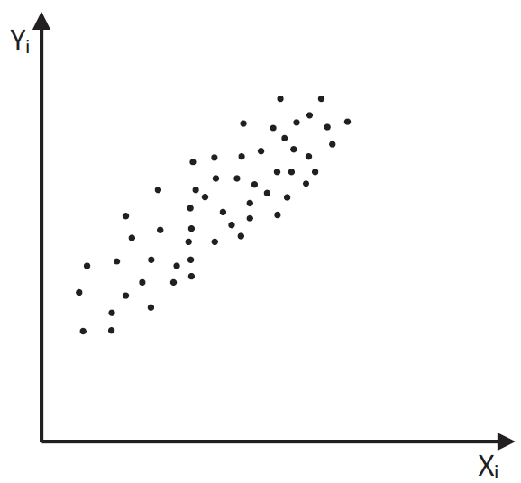
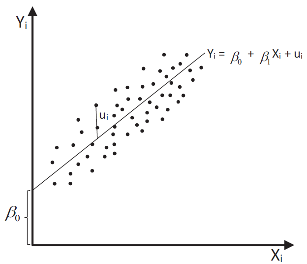
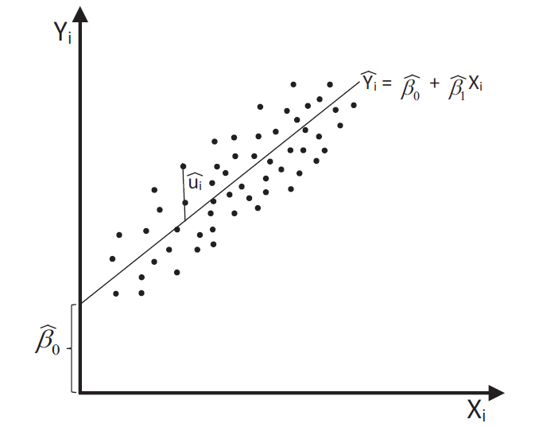

```{r setup, include = F}
# This is the recommended set up for flipbooks
# you might think about setting cache to TRUE as you gain practice --- building flipbooks from scratch can be time consuming
options(width = 70)
knitr::opts_chunk$set(
  dev.args = list(bg = 'transparent'),
  fig.width = 12, message = TRUE,
  warning = FALSE, comment = "", cache = TRUE, fig.retina = 3
)
knitr::opts_knit$set(global.par = TRUE)
Sys.setenv(`_R_S3_METHOD_REGISTRATION_NOTE_OVERWRITES_` = "false")
# remotes::install_github("luukvdmeer/sfnetworks")
# remotes::install_github("EvaMaeRey/flipbookr")
# remotes::install_github("rlesur/klippy")
# devtools::install_github("gadenbuie/xaringanExtra")
library(flipbookr)
library(xaringanthemer)
library(tidyverse)
library(klippy)
library(xaringanExtra)
library(gt); library(knitr); library(kableExtra); library(tibble)
library(summarytools); library(qrcode)
```

<style>
.notbold{
    font-weight:normal
}

body {
text-align: justify;
}

h1{
      margin-top: -1px;
      margin-bottom: -3px;
}

.small-code pre{
  margin-bottom: -10px;
  
}  

.medium-code pre{
  margin-bottom: 2px;
  
}

p.comment {
background-color: #E1E1FF;
padding: 10px;
border: 1px solid white;
margin-left: 25px;
border-radius: 15px;
text-align: center;
}
</style>

```{r xaringan-scribble, echo=FALSE}
xaringanExtra::use_scribble()
```

```{r xaringanExtra-clipboard, echo=FALSE}
htmltools::tagList(
  xaringanExtra::use_clipboard(
    button_text = "<i class=\"fa fa-clipboard\"></i>",
    success_text = "<i class=\"fa fa-check\" style=\"color: #90BE6D\"></i>",
    error_text = "<i class=\"fa fa-times-circle\" style=\"color: #F94144\"></i>"
  ),
  rmarkdown::html_dependency_font_awesome()
)
```

```{r xaringan-extra-styles, echo=FALSE}
xaringanExtra::use_extra_styles(
  hover_code_line = TRUE,         #<<
  mute_unhighlighted_code = TRUE  #<<
)
```

<font size = "5">

<br>
<br>
<br>
<br>
<br>
Link slides en formato [html](https://gusgarciacruz.github.io/EconometriaMEA/Tema3/Tema3.html)

Link slides en formato [PDF](https://gusgarciacruz.github.io/EconometriaMEA/Tema3/Tema3.pdf)

---
# <span style="font-size:80%">En este tema</span>

- <span style="font-size:150%">[<span style="color:black">Una presentación intuitiva](#presentacion)</span> <br> <br>

- <span style="font-size:150%">[<span style="color:black">El concepto de perturbación aleatoria](#perturbacion)</span> <br> <br>

- <span style="font-size:150%">[<span style="color:black">En resumen](#resumen)</span> <br> <br>

- <span style="font-size:150%">[<span style="color:black">Obtención de los estimadores Mínimos Cuadrados Ordinarios (MCO)](#MCO)</span> <br> <br>

- <span style="font-size:150%">[<span style="color:black">Propiedades de los estimadores MCO](#propiedades)</span> <br> <br>

- <span style="font-size:150%">[<span style="color:black">Ejercicio aplicado en R](#R)</span>

---
# <span style="font-size:80%">Lecturas</span>
<font size = "5">

- Wooldridge, Jeffrey (2013). *Introducción a la econometría*. 5a edición, Cengage Learning. <span style="color:blue">Cap. 2 y 3</span>

- Gujarati, D. y Porter, D. (2010). *Econometría*. 5a edición, Mc Graw Hill. <span style="color:blue">Cap. 2 y 3</span>

---
name: presentacion
# <span style="font-size:80%">Una presentación intuitiva</span>
<font size = "5">

- El problema a estudiar tiene que ver con el consumo de los individuos y sus ingresos en una comunidad:
<center> 
$Y_{i}:$ consumo del individuo $i$ <br>
$X_{i}:$ ingreso del individuo $i$, $i=1,2,...,n$ 
 

- La observación de la realidad mostraría

```{r, echo=FALSE, out.width="37%",fig.align='center'}

```

---
# <span style="font-size:80%">Una presentación intuitiva</span>
<spam style="font-size:100%">

A nivel teórico qué se puede decir? <span style="color:blue">Existe una relación positiva entre el consumo y el ingreso, por lo que es posible ajustar una línea recta que pase por el medio de los puntos y cada individuo se aleja positiva y negativamente de ella</span>


```{r, echo=FALSE, out.width="37%",fig.align='center'}

```

La representación matemática del modelo es:

<span style="color:blue"> $$Y_{i}=\beta_{0}+\beta_{1}X_{i}+u_{i}$$</span>
$\beta_{0}:$ consumo autónomo (intercepto)<br>
$\beta_{1}:$ propensión marginal a consumir el ingreso (pendiente)<br>
$u_{i}:$ perturbación aleatoria

---
# <span style="font-size:80%">Una presentación intuitiva</span>
<spam style="font-size:120%">

- El problema a resolver es encontrar una representación muestral del modelo:

$$Y_{i}=\hat{\beta}_{0}+\hat{\beta}_{1}X_{i}+\hat{u}_{i}$$
$\widehat{\beta}_{0}:$ estima a $\beta_{0}$<br>
$\widehat{\beta}_{1}:$ estima a $\beta_{1}$<br>
$\widehat{u}_{i}:$ es la contraparte muestral de $u_{i}$

- Este ejercicio permite responder otras preguntas que subyacen de la teoría:
<p style="margin-bottom: -1em">
 - El consumo autónomo es positivo
 - El consumo autónomo es 100
 - La propensión marginal a consumir es 0.8

- El ejercicio econométrico busca ver si los datos contradicen o no las hipótesis teóricas
<p style="margin-bottom: -0.5em">
- <span style="color:blue">No hay teorías verdaderas sino modelos útiles</span>
<p style="margin-bottom: -0.5em">
- Si los datos no contradicen las hipótesis el modelo puede ser útil
<p style="margin-bottom: -0.5em">
- Para poder hacer este ejercicio se requiere la inferencia estadística. <span style="color:blue">Esto implica hacer supuestos acerca de $u_{i}$</span>

---
name: perturbacion
# <span style="font-size:80%">El concepto de perturbación aleatoria</span>
<spam style="font-size:125%">

- <span style="color:blue">Perturbación aleatoria</span>: aquella que hace compatible la realidad y la teoría:

$$u_{i}=\underbrace{Y_{i}}_{\text{Realidad}}-\underbrace{(\beta_{0}-\beta_{1}X_{i})}_{\text{Teoría}}$$

Características   | Definición matemática    | Contraparte muestral
:----------------:|:------------------------:|:---------------------:
Media             |      $E(u_{i})$          | $\bar{\hat{u}}_{i}=\frac{\sum\hat{u}_{i}}{n}$
Varianza          | $E(u_{i}-E(u_{i}))^2$    | $\hat{\sigma}^{2}_{\hat{u}_{i}}=\frac{\sum(\hat{u}_{i}-\bar{\hat{u}})^2}{n}=\frac{\sum\hat{u}_{i}^2}{n}$
Covarianza        | $E[(u_{i}-E(u_{i}))(u_{j}-E(u_{j}))]$ | $\frac{1}{n-1} \sum(\hat{u}_{i}-\bar{\hat{u}})(\hat{u}_{j}-\bar{\hat{u}})$


- Al considerar que $u_{i}$ es una variable aleatoria tiene sentido hablar de sus características y los supuestos que se deben hacer sobre éstas

- Hay también una distribución muestral asociada, por ejemplo:

$$u_{i}\sim N(E(u_{i});E(u_{i}-E(u_{i}))^2)$$

---
# <span style="font-size:80%">El concepto de perturbación aleatoria</span>
<font size = "5">

Para completar la especificación del modelo de RLS se requiere hacer supuestos acerca de $u_{i}$:

 - <span style="font-size:95%"> $E(u_{i})=0 \Longrightarrow$ <span style="color:blue">modelo completo</span></span>
 
 - <span style="font-size:95%"> $Var(u_{i})=E(u_{i}-E(u_{i}))^2=E(u_{i}^2)=\sigma_{u}^2 \Longrightarrow$ <span style="color:blue">homocedasticidad</span>
 
 - <span style="font-size:95%"> $Cov(u_{i},u_{j})=E[(u_{i}-E(u_{i}))(u_{j}-E(u_{j}))]=E(u_{i}u_{j})=0$, $i\neq j$ $\Longrightarrow$ <span style="color:blue">no autocorrelación</span>
 
- <span style="font-size:95%"> $u_{i}\sim NID(0;\sigma_{u}^2)\Longrightarrow$ <span style="color:blue">normalidad</span>

---
name: resumen
# <span style="font-size:80%">En resumen</span>
<font size = "5">

El modelo de RLS tiene la siguiente especificación:

$$Y_{i}=\beta_{0}+\beta_{1} X_{i}+u_{i}$$

<p style="margin-bottom: 2em">

$Y$                       | $X$
:------------------------:|:------:
Variable dependiente      | Variable independiente
Variable explicada        | Variable explicativa
Variable de respuesta     | Variable de control
Variable predicha         | Variable predictora
Regresando                | Regresor 

---
# <span style="font-size:80%">En resumen</span>
<font size = "5">

- El modelo RLS se especifica así:
<p style="margin-bottom: -1em">
 - $\beta_{0}$ y $\beta_{1}$: coeficientes fijos (parámetros)
<p style="margin-bottom: -0.5em"> 
 - Modelo completo $E(u_{i})=0$
<p style="margin-bottom: -0.5em"> 
 - Homocedasticidad $Var(u_{i})=E(u_{i}^2)=\sigma_{u}^2$ (este es el otro parámetro del modelo)
<p style="margin-bottom: -0.5em"> 
 - No autocorrelación $Cov(u_{i},u_{j})=E(u_{i}u_{j})=0$, $i\neq j$

- Supuestos sobre $X_{i}$:
<p style="margin-bottom: -1em">
	- $X_{i}$ es estocasticamente fija, no es aleatoria, esta predeterminada antes de observar a $Y_{i}$
<p style="margin-bottom: -0.5em">	
	- $X_{i}$ no aleatoria corresponde a situaciones de laboratorio donde se puede controlar un experimento y fijar ex-ante los valores de la variable explicatoria $X_{i}$
<p style="margin-bottom: -0.5em">
  - Pero en economía esto no sucede, normalmente se observan $Y_{i}$ y $X_{i}$ al mismo tiempo 
<p style="margin-bottom: -0.5em">
	- <span style="color:blue">Lo más delicado en economía es que $X_{i}$ en otro modelo pueda ser la variable a explicar. Esto en econometría se refiere a que <ins> $X_{i}$ es endógena</ins>, violando uno de los supuesto importantes que <ins> $X_{i}$ debe ser exogena</ins>
	
---
# <span style="font-size:80%">En resumen</span>
<font size = "5">

- Para resolver esta situación Haavelmo (1948) formuló la hipótesis de <span style="color:blue">exogeneidad</span>: si la variable explicatoria es de naturaleza aleatoria, debe ser <span style="color:blue">estadísticamente independiente de la perturbación aleatoria</span>

$$\begin{array}{cl}
Cov(X_{i},u_{i}) & =E[(X_{i}-E(X_{i}))(u_{i}-E(u_{i}))]\\
                 & = E[(X_{i}-E(X_{i}))u_{i}]\\
                 & = E[(X_{i}-E(X_{i}))]E(u_{i})\\
                 & = 0
\end{array}$$

- Hipótesis de normalidad $u_{i}\sim NID(0;\sigma_{u}^2)$

---
name: MCO
# <span style="font-size:80%">Obtención de los estimadores Mínimos Cuadrados Ordinarios (MCO)</span>
<font size = "5">

Los tres métodos (existen más) más comúnmente utilizados para estimar $\beta_{0}$ y $\beta_{1}$ en le modelo RLS $Y_{i}=\beta_{0}+\beta_{1} X_{i}+u_{i}$ son:

- <span style="color:blue">MCO: Minimizar la SCR (Suma de Cuadrado de los Residuales $\sum \widehat{u}_{i}^2$)

- MM: Método de los momentos (usa supuestos paramétricos)

- MV: Maximizar la función de verosimilitud (supone una distribución normal)

---
# <span style="font-size:80%">Obtención de los estimadores Mínimos Cuadrados Ordinarios (MCO)</span>
<spam style="font-size:100%">

Es un método de ajuste de curvas, geométrico, que no establece supuestos. Lo único que establece es que existe un residuo en las estimaciones

$$Y_{i}=\widehat{\beta}_{0}+\widehat{\beta}_{1} X_{i}+\widehat{u}_{i}\Longrightarrow \text{modelo estimado}$$
$\widehat{u}_{i}$: residuo en la estimación

$\widehat{\beta}_{0}$ y $\widehat{\beta}_{1}$ son aquellos que resultan de minimizar libremente la SCR $(\sum \widehat{u}_{i}^2)$


$$\sum \widehat{u}_{i}^2=\sum(Y_{i}-\widehat{\beta}_{0}-\widehat{\beta}_{1} X_{i})^2$$
$$\frac{\partial \sum\widehat{u}_{i}^2}{\partial \widehat{\beta}_{0}}=-2\sum(Y_{i}-\widehat{\beta}_{0}-\widehat{\beta}_{1} X_{i})=0$$
<span style="color:blue"> $$\sum Y_{i} = n\widehat{\beta}_{0} + \widehat{\beta}_{1} \sum X_{i} \text{ (1)}$$ </span>

$$\frac{\partial \sum\widehat{u}_{i}^2}{\partial \widehat{\beta}_{1}}=-2\sum(Y_{i}-\widehat{\beta}_{0}-\widehat{\beta}_{1} X_{i})X_{i}=0$$
<span style="color:blue"> $$\sum X_{i}Y_{i} = \widehat{\beta}_{0}\sum X_{i} + \widehat{\beta}_{1} \sum X_{i}^2 \text{ (2)}$$</span>

(1) y (2) se llaman <span style="color:blue">ecuaciones normales</span> y al resolverlas aparecen los estimadores MCO

---
# <span style="font-size:80%">Obtención de los estimadores Mínimos Cuadrados Ordinarios (MCO)</span>
<spam style="font-size:100%">
<p style="margin-bottom: -1em">
**<span style="color:blue"><ins>MCO: Minimizando la SCR</ins></span>**

Si dividimos la ecuación (1) por $n$ tenemos
<p style="margin-bottom: -1em">

$$ \frac{\sum Y_{i}}{n} = \frac{n \hat{\beta}_0 + \hat{\beta}_1 \sum X_i}{n} $$

$$\bar{Y} = \hat{\beta}_{0} + \hat{\beta}_{1} \bar{X}$$
<p style="margin-bottom: -0.5em">
Quiere decir que $(\bar{X}, \bar{Y})$ como punto esta situado sobre la recta mínima cuadrática

$$\hat{Y}_{i} = \hat{\beta}_{0} + \hat{\beta}_{1} X_{i} \text{ ó } Y_{i} = \hat{\beta}_{0} + \hat{\beta}_{1} X_{i} + \hat{u}_{i}$$

```{r, echo=FALSE, out.width="28%",fig.align='center'}

```

<span style="color:blue"> $$\hat{\beta}_{0} = \bar{Y} - \widehat{\beta}_{1} \bar{X} \text{ (3)}$$</span> 

---
# <span style="font-size:80%">Obtención de los estimadores Mínimos Cuadrados Ordinarios (MCO)</span>
<spam style="font-size:100%">
<p style="margin-bottom: -1em">
**<span style="color:blue"><ins>MCO: Minimizando la SCR</ins></span>**

Volviendo sobre la derivada de $\beta_{1}$ y empleando (3) para sustituir $\hat{\beta}_{0}$, se obtiene

$$\sum(Y_{i}-(\bar{Y} - \hat{\beta}_{1} \bar{X})-\hat{\beta}_{1} X_{i})X_{i}=0$$
$$\sum X_{i}(Y_{i}-\bar{Y}) = \hat{\beta}_{1} \sum X_{i}(X_{i}-\bar{X})$$
$$\hat{\beta}_{1} = \frac{\sum X_{i}(Y_{i}-\bar{Y})}{\sum X_{i}(X_{i}-\bar{X})}$$

Es posible demostrar que

$$\sum X_{i}(X_{i}-\bar{X}) = \sum (X_{i}-\bar{X})^2$$
$$\sum X_{i}(Y_{i}-\bar{Y}) = \sum (X_{i}-\bar{X})(Y_{i}-\bar{Y})$$

Por tanto, la pendiente estimada es


<span style="color:blue"> $$\hat{\beta}_{1} = \frac{\sum (X_{i}-\bar{X})(Y_{i}-\bar{Y})}{\sum (X_{i}-\bar{X})^2} = \frac{\sum x_{i}y_{i}}{\sum x_{i}^2} \text{ (4) }$$

donde $x_{i} = X_{i}-\bar{X}$ y $y_{i} = Y_{i}-\bar{Y}$ 

---
# <span style="font-size:80%">Obtención de los estimadores Mínimos Cuadrados Ordinarios (MCO)</span>
<spam style="font-size:100%">

<p style="margin-bottom: -1em">
**<span style="color:blue"><ins>MCO: Minimizando la SCR</ins></span>**

En resumen
- Al minimizar la $SCR=\sum \widehat{u}_{i}^2$ se obtuvo la primera ecuación normal:

<span style="color:blue"> $$\widehat{\beta}_{0} = \bar{Y} - \widehat{\beta}_{1} \bar{X}$$

- Con la segunda ecuación normal y reemplazando $\hat{\beta}_{0}$ se obtuvo:
<span style="color:blue"> $$\hat{\beta}_{1} = \frac{\sum x_{i}y_{i}}{\sum x_{i}^2}$$

Que representan los estimadores MCO de $\beta_0$ y $\beta_1$

---
name: propiedades
# <span style="font-size:80%">Propiedades de los estimadores MCO</span>
<spam style="font-size:110%">

La pregunta ahora es qué pasa con las propiedades de los estimadores MCO a la luz de los supuestos. Se trata del encuentro de dos mundos:

- Lo teórico 

$$Y_{i} = \beta_{0} + \beta_{1} X_{i} + u_{i}, \beta_{0}, \beta_{1} \text{ son fijos}$$
$$E(u_{i})=0; Var(u_{i}) = \sigma_{u}^2; Cov(u_{i},u_{j})=0$$
$$Cov(X_{i},u_{i})=0; u_{i}\sim NID(0;\sigma_{u}^2)$$
- Lo empírico 

$$\hat{\beta}_{1} = \frac{\sum x_{i}y_{i}}{\sum x_{i}^2}$$
$$\widehat{\beta}_{0} = \bar{Y} - \widehat{\beta}_{1} \bar{X}$$

Es posible demostrar que los estimadores MCO son ELIO (o BLUE)
<p style="margin-bottom: -1em">
- Estimadores
- Lineales
- Insesgados
- Óptimos

---
# <span style="font-size:80%">Propiedades de los estimadores MCO</span>
<font size = "5">

- <span style="color:blue">Linealidad</span>: los estimadores MCO son polinomios lineales en $Y_{i}$ y $u_{i}$

- <span style="color:blue">Insesgadez</span>: $E(\hat{\beta}_{1})=\beta_{1}$ y $E(\hat{\beta}_{0})=\beta_{0}$

- <span style="color:blue">Óptimos</span>: dentro de la clase de estimadores lineales e insesgados del modelo, los estimadores MCO tienen la mínima varianza, dentro de los estimadores que utilizan igual cantidad de información (Teorema de Gauss-Markov)

<center>	
<span style="color:blue">Mínima varianza = Máxima precisión
</center>

---
name: R
# <span style="font-size:80%">Ejercicio aplicado en R</span>
<font size = "5">

Los accidentes de tráfico son la principal causa de muerte de los estadounidenses entre los 5 y los 32 años de edad. Mediante distintas políticas de gasto, el gobierno federal ha alentado a los estados
a instituir normativas de obligatoriedad de uso del cinturón de seguridad para reducir el número de muertes y lesiones graves. 

En este ejercicio se investigará la eficacia de estas leyes para el aumento del uso del cinturón de seguridad y la reducción de víctimas mortales. El archivo [SeatBelts.xls](https://wps.pearsoned.com/wps/media/objects/11422/11696965/empirical/empex_tb/SeatBelts.xls) contiene un panel de datos sobre 50 estados de los EE.UU., además del distrito de Columbia para los años 1983-1997. Se ofrece una descripción detallada en el archivo [SeatBelts_Description.pdf](https://wps.pearsoned.com/wps/media/objects/11422/11696965/empirical/empex_tb/SeatBelts_Description.pdf)

- Estime el efecto del uso del cinturón de seguridad sobre las muertes mediante la regresión de la variable $fatalityrate$ sobre la variable $sb\_useage$. ¿La regresión estimada sugiere que un mayor uso del cinturón de seguridad reduce las muertes?

- Interprete los resultados

- ¿Cuántas vidas se salvarían si el uso del cinturón de seguridad aumentara de 52% a 90%?