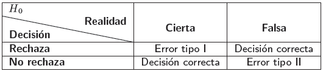
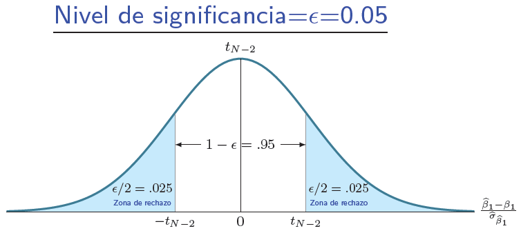
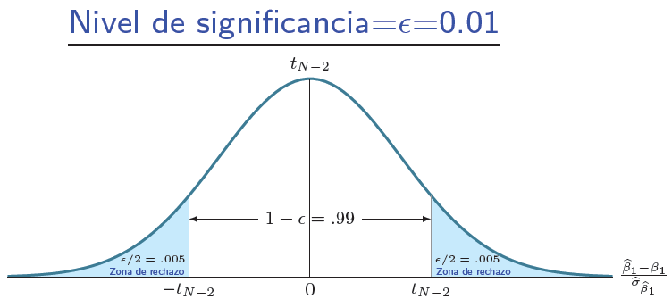
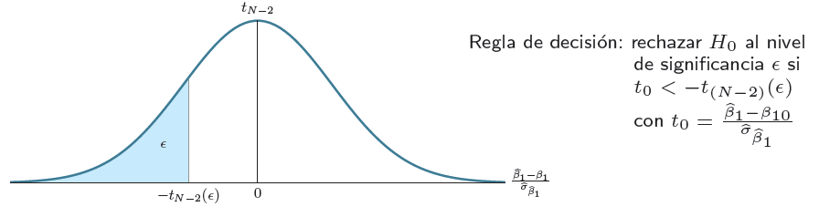
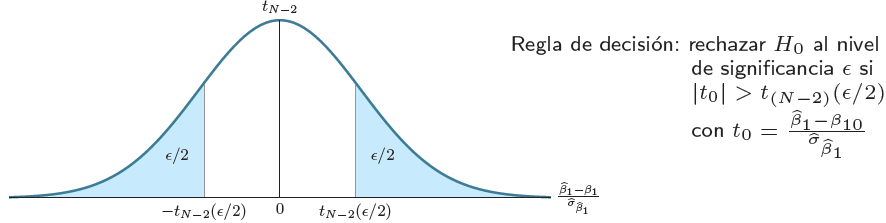
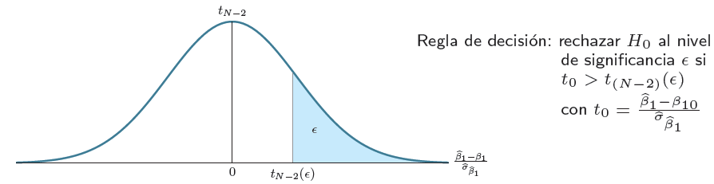

```{r setup, include = F}
# This is the recommended set up for flipbooks
# you might think about setting cache to TRUE as you gain practice --- building flipbooks from scratch can be time consuming
options(width = 70)
knitr::opts_chunk$set(
  dev.args = list(bg = 'transparent'),
  fig.width = 12, message = TRUE,
  warning = FALSE, comment = "", cache = TRUE, fig.retina = 3
)
knitr::opts_knit$set(global.par = TRUE)
Sys.setenv(`_R_S3_METHOD_REGISTRATION_NOTE_OVERWRITES_` = "false")
# remotes::install_github("luukvdmeer/sfnetworks")
# remotes::install_github("EvaMaeRey/flipbookr")
# remotes::install_github("rlesur/klippy")
# devtools::install_github("gadenbuie/xaringanExtra")
library(flipbookr)
library(xaringanthemer)
library(tidyverse)
library(klippy)
library(xaringanExtra)
library(gt); library(knitr); library(kableExtra); library(tibble)
library(summarytools); library(qrcode)
```

<style>
.notbold{
    font-weight:normal
}

body {
text-align: justify;
}

h1{
      margin-top: -1px;
      margin-bottom: -3px;
}

.small-code pre{
  margin-bottom: -10px;
  
}  

.medium-code pre{
  margin-bottom: 2px;
  
}

p.comment {
background-color: #E1E1FF;
padding: 10px;
border: 1px solid white;
margin-left: 25px;
border-radius: 15px;
text-align: center;
}
</style>

```{r xaringan-scribble, echo=FALSE}
xaringanExtra::use_scribble()
```

```{r xaringanExtra-clipboard, echo=FALSE}
htmltools::tagList(
  xaringanExtra::use_clipboard(
    button_text = "<i class=\"fa fa-clipboard\"></i>",
    success_text = "<i class=\"fa fa-check\" style=\"color: #90BE6D\"></i>",
    error_text = "<i class=\"fa fa-times-circle\" style=\"color: #F94144\"></i>"
  ),
  rmarkdown::html_dependency_font_awesome()
)
```

```{r xaringan-extra-styles, echo=FALSE}
xaringanExtra::use_extra_styles(
  hover_code_line = TRUE,         #<<
  mute_unhighlighted_code = TRUE  #<<
)
```

<font size = "5">

<br>
<br>
<br>
<br>
<br>
Link slides en formato [html](https://gusgarciacruz.github.io/EconometriaMEA/Tema4/Tema4.html)

Link slides en formato [PDF](https://gusgarciacruz.github.io/EconometriaMEA/Tema4/Tema4.pdf)

---
# <span style="font-size:80%">En este tema</span>

- <span style="font-size:150%">[<span style="color:black">Introducción](#introduccion)</span> <br> <br>

- <span style="font-size:150%">[<span style="color:black">Pruebas de hipótesis](#ph)</span> <br> <br>

- <span style="font-size:150%">[<span style="color:black">Intervalos de confianza](#ic)</span><br> <br>

- <span style="font-size:150%">[<span style="color:black">La estrecha relación entre los intervalos de confianza y las pruebas de hipótesis](#relacion)</span> <br> <br>

- <span style="font-size:150%">[<span style="color:black">Ejercicio aplicado en R](#R)</span>
---
# <span style="font-size:80%">Lecturas</span>
<font size = "5">

- Wooldridge, Jeffrey (2013). *Introducción a la econometría*. 5a edición, Cengage Learning. <span style="color:blue">Cap. 4</span>

- Gujarati, D. y Porter, D. (2010). *Econometría*. 5a edición, Mc Graw Hill. <span style="color:blue">Cap. 5</span>

---
name: introduccion 
# <span style="font-size:80%">Introducción</span>
<font size = "5">

El modelo de RLS presenta la siguiente estructura:

$$Y_{i} = \beta_{0} + \beta_{1} X_{i}+ u_{i}$$

En la estimación de los parámetros del modelo tenemos

Parámetro   | Estimador        | Varianza estimada
:----------:|:----------------:|:----------------:
$\beta_{0}$ | $\hat{\beta}_{0}=\bar{Y}-\widehat{\beta}_{1}\overline{X}$ | $\hat{\sigma}_{\widehat{\beta}_{0}}^2=\frac{\widehat{\sigma}_{u}^2 \sum X_{i}^2}{n\sum x_{i}^2}$
$\beta_{1}$ | $\hat{\beta}_{1}=\frac{\sum (X_{i}-\overline{X})(Y_{i}-\overline{Y})}{\sum (X_{i}-\overline{X})^2}=\frac{\sum x_{i}y{i}}{\sum x_{i}^2}$ | $\hat{\sigma}_{\hat{\beta}_{1}}^2=\frac{\hat{\sigma}_{u}^2}{\sum x_{i}^2}$
$\sigma_{u}^2$    | $\hat{\sigma}_{u}^2=\frac{\sum{\hat{u}^2}}{n-2}$ | -

---
# <span style="font-size:80%">Introducción</span>
<font size = "5">	

- El método estadístico intenta decir cosas sobre <span style="color:blue">los parámetros poblacionales</span> con base en los <span style="color:blue">estadísticos muestrales</span>

- En el caso del modelo de RLS, <span style="color:blue">consiste en decir algo acerca de $\beta_{0}$ y $\beta_{1}$ con base en $\hat{\beta}_{0}$ y $\hat{\beta}_{1}$</span>

- Lo anterior implica construir <span style="color:blue">intervalos de confianza</span> y <span style="color:blue">pruebas de hipótesis</span> para $\beta_{0}$ y $\beta_{1}$

---
name: ph
# <span style="font-size:80%">Pruebas de hipótesis</span>
<font size = "5">	

- Ahora se quiere verificar estadísticamente una afirmación como la siguiente: $\beta_{1} = \beta_{10}$, esto es, verificar la hipótesis nula $(H_{0})$: <span style="color:blue"> $H_{0}:\beta_{1} = \beta_{10}$

- En estadística las <span style="color:blue">hipótesis</span> se </span> <span style="color:blue">rechazan</span> o <span style="color:blue">no se rechazan

- Lo importante en la inferencia estadística es:
	- suponer que $H_{0}$ es cierta
	- encontrar la distribución muestral bajo $H_{0}$
	- observar la realidad bajo el supuesto de $H_{0}$ cierta
	- <span style="color:blue">si lo observado es poco probable</span> $\Longrightarrow$ <span style="color:blue">rechazar $H_{0}$</span><br>
		<span style="color:blue">si lo observado es probable</span> $\Longrightarrow$ <span style="color:blue">no rechazar $H_{0}$</span>

- En consecuencia, las hipótesis nulas $(H_{0})$ que se verifican son del tipo <span style="color:blue">igualdad a</span>, ya que es bajo este supuesto que se dan las distribuciones muestrales conocidas

- Cuando se esta bajo hipótesis nulas del tipo $>$, $<$ o $\neq$ se tienen otras distribuciones
 
---
# <span style="font-size:80%">Pruebas de hipótesis</span>
<font size = "5">	

Tenemos que el método estadístico de toma de decisiones implica:
- Formular una hipótesis nula (en términos de igualdad) y una hipótesis alternativa
	
	$$H_{0}: \beta_{1} = \beta_{10}$$
$$\begin{array}{cl}
H_{A}: &\beta_{1} < \beta_{10} \text{ ó}\\
       &\beta_{1} \neq \beta_{10} \text{ ó}\\
       &\beta_{1} > \beta_{10}
\end{array}$$

- Hay que encontrar la distribución muestral del estadígrafo apropiado, bajo $H_{0}$
	
	$$\text{Bajo } H_{0} \frac{\hat{\beta}_{1}-\beta_{10}}{\hat{\sigma}_{\widehat{\beta}_{1}}}\sim t_{N-2} \text{ gdl}$$
- Dado esto se define el nivel de significancia aceptable en la prueba $(\epsilon)$

---
# <span style="font-size:80%">Pruebas de hipótesis</span>
<font size = "5">	

- No se debe olvidar que cualquier decisión que se tome se hace en condiciones de incertidumbre:
	
```{r, echo=FALSE, out.width="65%",fig.align='center'}

```

- $Prob(\text{Cometer error tipo I})=\epsilon \Longrightarrow$ Nivel de significancia

- $1-Prob(\text{Cometer error tipo II}) \Longrightarrow$ Potencia de la prueba

---
# <span style="font-size:80%">Pruebas de hipótesis</span>
<spam style="font-size:110%">

La mecánica es
- Se formula el contraste
$$H_{0}: \beta_{1} = \beta_{10}$$
$$\begin{array}{cl}
H_{A}: &\beta_{1} < \beta_{10} \text{ ó}\\
       &\beta_{1} \neq \beta_{10} \text{ ó}\\
       &\beta_{1} > \beta_{10}
\end{array}$$
	
- Bajo $H_{0}$ cierto el estadístico de prueba ($t_0$) será:

$$t_0 = \frac{\widehat{\beta}_{1}-\beta_{10}}{\widehat{\sigma}_{\widehat{\beta}_{1}}}\sim t_{N-2} \text{gdl}$$
- Se establece una regla de decisión en función de $H_{0}$:
 - si $H_{A}: \beta_{1}<\beta_{10} \Longrightarrow t_{0}=\frac{\widehat{\beta}_{1}-\beta_{10}}{\widehat{\sigma}_{\widehat{\beta}_{1}}} < -t_{N-2} (\epsilon) \Longrightarrow$ Rechazo $H_{0}$
 - si $H_{A}: \beta_{1}\neq\beta_{10} \Longrightarrow |t_{0}|=\frac{\widehat{\beta}_{1}-\beta_{10}}{\widehat{\sigma}_{\widehat{\beta}_{1}}} > t_{N-2} (\epsilon/2) \Longrightarrow$ Rechazo $H_{0}$
 - si $H_{A}: \beta_{1}>\beta_{10} \Longrightarrow t_{0}=\frac{\widehat{\beta}_{1}-\beta_{10}}{\widehat{\sigma}_{\widehat{\beta}_{1}}} > t_{N-2} (\epsilon) \Longrightarrow$ Rechazo $H_{0}$
 
---
# <span style="font-size:80%">Pruebas de hipótesis</span>
<spam style="font-size:110%">

- *<span style="color:blue">p-value</span>*: la probabilidad del límite derecho de $H_{0}$ bajo el supuesto de que es cierta

- La regla es rechazar $H_{0}$ si
	<center>
	
	*<span style="color:blue">p-value</span>* $< \epsilon$
	
Donde el *p-value* $(t_{0})=2(1-F(|t_{0}|,m))$, $m$ son los grados de libertad
	
- Gráficamente sería:

.pull-left-50[
```{r, echo=FALSE, out.width="150%",fig.align='center'}

```
]

.pull-right-50[
```{r, echo=FALSE, out.width="150%",fig.align='center'}

```
]

---
# <span style="font-size:80%">Pruebas de hipótesis</span>
<spam style="font-size:100%">

- En el nivel de significancia $(\epsilon)$ se tiene el número mágico del 5%

- <span style="color:blue">Si es del tipo $H_{A}:\beta_{1}<\beta_{10}$, se trata de una prueba con cola situada a la izquierda</span>

```{r, echo=FALSE, out.width="100%",fig.align='center'}

```

- Con el uso del *p-value*:

$$\text{p-value} = \int_{-\infty}^{t_{0}} t_{N-2} dt$$
Esto es exactamente el nivel marginal de significancia en el cual se puede rechazar $H_{0}$. La regla de decisión sería:

<center>
Rechazar $H_{0}$ si *p-value* $<\epsilon$

---
# <span style="font-size:80%">Pruebas de hipótesis</span>
<font size = "5">

- <span style="color:blue">Si la hipótesis alternativa es del tipo $H_A:\beta_{1}\neq\beta_{10}$, se tiene una prueba de dos colas

<p style="margin-bottom: 2em">


```{r, echo=FALSE, out.width="100%",fig.align='center'}

```

- En términos del *p-value* la regla de decisión sería:

<center>
Rechazar $H_{0}$ si *p-value* $<\epsilon$

---
# <span style="font-size:80%">Pruebas de hipótesis</span>
<font size = "5">

- <span style="color:blue">Si la hipótesis alternativa es del tipo $H_A:\beta_{1}>\beta_{10}$, se tiene una prueba con cola a la derecha

<p style="margin-bottom: 2em">


```{r, echo=FALSE, out.width="100%",fig.align='center'}

```

- En términos del *p-value* la regla de decisión sería:

<center>
Rechazar $H_{0}$ si *p-value* $<\epsilon$

---
name: ic
# <span style="font-size:80%">Intervalos de confianza</span>
<font size = "4">

**Definición**<br>
- Es la probabilidad de que dos valores extremos contengan el parámetro desconocido

- Son unos límites probabilísticos que contienen al verdadero parámetro (en este caso $\beta_{1}$) con una probabilidad de $1-\epsilon$ (nivel de confianza) 

**Definición matemática**

$$Prob\left[ \widehat{\beta}_{1} - \widehat{\sigma}_{\widehat{\beta}_{1}}t_{N-2} (\epsilon/2) \leq \beta_{1} \leq \widehat{\beta}_{1} + \widehat{\sigma}_{\widehat{\beta}_{1}}t_{N-2} (\epsilon/2) \right] = 1-\epsilon$$
**Interpretación**

- La probabilidad de que el intervalo que va desde $\widehat{\beta}_{1} - \widehat{\sigma}_{\widehat{\beta}_{1}}t_{N-2} (\epsilon/2)$ hasta $\widehat{\beta}_{1} + \widehat{\sigma}_{\widehat{\beta}_{1}}t_{N-2} (\epsilon/2)$ contenga el verdadero valor de $\beta_{1}$ es $1-\epsilon$

- El intervalo de confianza $\widehat{\beta}_{1} \pm \widehat{\sigma}_{\widehat{\beta}_{1}}t_{N-2} (\epsilon/2)$ contiene a $\beta$ con una probabilidad de $1-\epsilon$

- En el $(1-\epsilon)\%$ de los casos el intervalo contendrá el parámetro $\beta_{1}$

- $IC_{(1-\epsilon)} (\beta_{1}) = \widehat{\beta}_{1} \pm \widehat{\sigma}_{\widehat{\beta}_{1}}t_{N-2} (\epsilon/2)$\\
	\hspace*{1.67cm}                     = \small{Estimador $\pm$ Error de estimación (Valor t-student)}

---
name: relacion
# <span style="font-size:80%">La estrecha relación entre los intervalos de confianza y las pruebas de hipótesis</span>
<font size = "5">

- Se rechaza la hipótesis nula $H_{0}: \beta_{1}=\beta_{10}$ a un nivel de significancia $\epsilon$, cuando $\beta_{10}$ cae por fuera del correspondiente $100(1-\epsilon)\%$ intervalo de confianza

- En nuestro ejemplo wage-educ, $\beta_{10}=0$ no cae dentro del intervalo de confianza del 95% (0.436, 0.645), y por tanto, usando este enfoque, nosotros de nuevo rechazamos $H_{0}: \beta_{1}=0$ a un nivel de significancia del 5%

- <span style="color:blue">De hecho, se rechaza cualquier hipótesis nula donde $\beta_{10}$ no esta contenido en el intervalo de confianza (0.436, 0.645)

- Por otro lado, <span style="color:blue">Si el IC(95%) contiene el cero, $\beta_{1}$ no es significativo al 5%

---
name: R
# <span style="font-size:80%">Ejemplo en R</span>
<font size = "5">

Se tiene una base de datos de corte transversal de 526 trabajadores correspondientes a 1976 para los Estados unidos. $wage$ son los salarios en dólares por hora y $educ$ los años de educación. Se desea estimar el siguiente modelo:

$$wage = \beta_{0} + \beta_{1}educ + u$$
```{r message=FALSE, warning=FALSE}
library(haven); library(summarytools); library(Hmisc); library(tidyverse)
data <- read_stata("http://fmwww.bc.edu/ec-p/data/wooldridge/wage1.dta")
# Descripción de la base de datos: http://fmwww.bc.edu/ec-p/data/wooldridge/wage1.des
names(data)

descr(data[,c("educ","wage")], stats = "common", transpose = TRUE, headings  = FALSE)
```

---
# <span style="font-size:80%">Ejemplo en R</span>
<font size = "5">

```{r}
st_options(lang = "es", footnote=NA, headings = FALSE)
print(dfSummary(data[,c("educ","wage")], valid.col = FALSE, silent=FALSE), method = "render", varnumbers=F)
```

---
# <span style="font-size:80%">Ejemplo en R</span>
<font size = "5">

```{r}
# Correlaciones
cor(data[,c("wage","educ")])

# Correlaciones con significancia estadística
rcorr(as.matrix(data[,c("wage","educ")]))
```

---
# <span style="font-size:80%">Ejemplo en R</span>
<font size = "5">

```{r}
# Densidades de los salarios
ggplot(data, aes(x=wage)) + 
  geom_density(fill="lightblue")
```

---
# <span style="font-size:80%">Ejemplo en R</span>
<font size = "5">

```{r}
# Densidades de los salarios por género
data <- data |> mutate(sex = case_when(female==1~"F", female==0~"M"))
ggplot(data, aes(x=wage, fill=sex)) + geom_density(alpha=0.3) +
  scale_fill_manual(name="Género", labels = c("Mujer", "Hombre"),values=c("red","blue")) + labs(x= "Salario", y="Densidad") 
```

---
# <span style="font-size:80%">Ejemplo en R</span>
<font size = "5">

```{r}
plot(data$wage~data$educ)
```

---
# <span style="font-size:80%">Ejemplo en R</span>
<font size = "5">

```{r}
ggplot(data, aes(x=educ, y=wage)) + 
  geom_point()
```

---
# <span style="font-size:80%">Ejemplo en R</span>
<font size = "5">

```{r}
ggplot(data, aes(x=educ, y=wage)) + 
  geom_point(alpha=0.5, color="red", size=2) + geom_smooth(formula=y~x, method=lm, linetype="dashed", color="blue") +
  labs(x= "Educación", y="Salario hora") + scale_x_continuous(breaks = seq(0, 18, by = 2))
```

---
# <span style="font-size:80%">Ejemplo en R</span>
<font size = "5">

```{r}
# El modelo de regresión
modelo <- lm(wage~educ, data=data)
summary(modelo)

# Intervalos de confianza
confint(modelo, level = 0.95)
```

---
# <span style="font-size:80%">Ejemplo en R</span>
<font size = "5">

```{r}
freq(data$female, headings = F)
```


.pull-left-50[
```{r}
# El modelo de regresión para mujeres
modelo_f <- lm(wage~educ, data=subset(data,female==1))
summary(modelo_f)
```
]

.pull-right-50[
```{r}
# El modelo de regresión para hombres
modelo_m <- lm(wage~educ, data=subset(data,female==0))
summary(modelo_m)
```
]