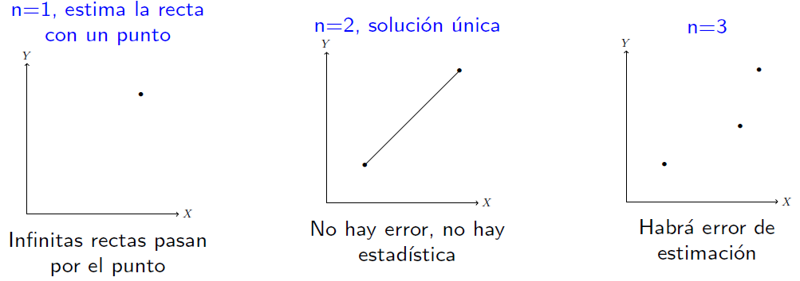

```{r setup, include = F}
# This is the recommended set up for flipbooks
# you might think about setting cache to TRUE as you gain practice --- building flipbooks from scratch can be time consuming
options(width = 70)
knitr::opts_chunk$set(
  dev.args = list(bg = 'transparent'),
  fig.width = 12, message = TRUE,
  warning = FALSE, comment = "", cache = TRUE, fig.retina = 3
)
knitr::opts_knit$set(global.par = TRUE)
Sys.setenv(`_R_S3_METHOD_REGISTRATION_NOTE_OVERWRITES_` = "false")
# remotes::install_github("luukvdmeer/sfnetworks")
# remotes::install_github("EvaMaeRey/flipbookr")
# remotes::install_github("rlesur/klippy")
# devtools::install_github("gadenbuie/xaringanExtra")
library(flipbookr)
library(xaringanthemer)
library(tidyverse)
library(klippy)
library(xaringanExtra)
library(gt); library(knitr); library(kableExtra); library(tibble)
library(summarytools); library(qrcode)
```

<style>
.notbold{
    font-weight:normal
}

body {
text-align: justify;
}

h1{
      margin-top: -1px;
      margin-bottom: -3px;
}

.small-code pre{
  margin-bottom: -10px;
  
}  

.medium-code pre{
  margin-bottom: 2px;
  
}

p.comment {
background-color: #E1E1FF;
padding: 10px;
border: 1px solid white;
margin-left: 25px;
border-radius: 15px;
text-align: center;
}
</style>

```{r xaringan-scribble, echo=FALSE}
xaringanExtra::use_scribble()
```

```{r xaringanExtra-clipboard, echo=FALSE}
htmltools::tagList(
  xaringanExtra::use_clipboard(
    button_text = "<i class=\"fa fa-clipboard\"></i>",
    success_text = "<i class=\"fa fa-check\" style=\"color: #90BE6D\"></i>",
    error_text = "<i class=\"fa fa-times-circle\" style=\"color: #F94144\"></i>"
  ),
  rmarkdown::html_dependency_font_awesome()
)
```

```{r xaringan-extra-styles, echo=FALSE}
xaringanExtra::use_extra_styles(
  hover_code_line = TRUE,         #<<
  mute_unhighlighted_code = TRUE  #<<
)
```

<font size = "5">

<br>
<br>
<br>
<br>
<br>
Link slides en formato [html](https://gusgarciacruz.github.io/EconometriaMEA/Tema5/Tema5.html)

Link slides en formato [PDF](https://gusgarciacruz.github.io/EconometriaMEA/Tema5/Tema5.pdf)

---
# <span style="font-size:80%">En este tema</span>

- <span style="font-size:150%">[<span style="color:black">El modelo](#modelo)</span> <br> <br>

- <span style="font-size:150%">[<span style="color:black">El modelo en matrices](#matrices)</span> <br> <br>

- <span style="font-size:150%">[<span style="color:black">Estimador MCO y propiedades](#mco)</span> <br> <br>

- <span style="font-size:150%">[<span style="color:black">Sesgo por variables omitidas](#sesgo)</span> <br> <br>

- <span style="font-size:150%">[<span style="color:black">El coeficiente de determinación $R^2$](#r2)</span> <br> <br>

- <span style="font-size:150%">[<span style="color:black">Inferencia estadística](#inferencia)</span> <br> <br>

- <span style="font-size:150%">[<span style="color:black">Ejercicio aplicado en R](#r)</span>

---
# <span style="font-size:80%">Lecturas</span>
<font size = "5">

- Wooldridge, Jeffrey (2013). *Introducción a la econometría*. 5a edición, Cengage Learning. <span style="color:blue">Cap. 3, 4 y 5</span>

- Gujarati, D. y Porter, D. (2010). *Econometría*. 5a edición, Mc Graw Hill. <span style="color:blue">Cap. 7 y 8</span>

---
name: modelo
# <span style="font-size:80%">El modelo</span>
<font size = "5">

El modelo de regresión lineal múltiple tiene la siguiente estructura:

$$Y_{i} = \beta_{1} + \beta_{2}X_{i2} + \beta_{3}X_{i3}+...+ \beta_{k}X_{ik} + u_{i}$$

El modelo entonces contiene $k$ parámetros poblacionales (desconocidos) 

Se trabaja, entonces, con $n-k$ gdl

La pregunta que surge es: <span style="color:blue">¿será suficiente decir que el modelo de RLM es una nueva extensión desde el modelo RLS $\Longrightarrow$ modelo RLM?

---
# <span style="font-size:80%">El modelo</span>
<font size = "4">

Recordando las hipótesis de partida (supuestos iniciales):

- Los coeficientes $\beta_{j}$ con $j=1,2,3,...,k$ son fijos y desconocidos

- Las $X_{ij}$ son estocásticamente fijas para $j=2,3,4,...,k$. Este es un supuesto de partida propio del laboratorio. Un supuesto más real en economía y que lleva a resultados similares es: las variables explicatorias son exógenas. Esto implica que:
	
	$$Cov(X_{i2},u_{i})=0$$
	$$Cov(X_{i3},u_{i})=0$$
$$\vdots$$

	$$Cov(X_{ik},u_{i})=0$$
- El modelo esta completo: $E(u_{i})=0, \forall i= 1...n$

- Homoscedasticidad: $Var(u_{i})=E(u_{i}-E(u_{i}))^2=E(u_{i}^2)=\sigma_{u}^2$

- No autocorrelación: $Cov(u_{i},u_{j})=E[(u_{i}-E(u_{i}))(u_{j}-E(u_{j}))]=E(u_{i}u_{j})=0, \forall i\neq j$

- Normalidad: $u_{i}\sim NID(0,\sigma_{u}^2)$

---
name: matrices
# <span style="font-size:80%">El modelo en matrices</span>
<font size = "4">

El modelo general es un polinomio de regresión de la forma:
<p style="margin-bottom: -1em">
$$Y_{i} = {\beta}_{1} + {\beta}_{2}X_{i2} + {\beta}_{3}X_{i3} +...+ {\beta}_{k}X_{ik} + {u}_{i}$$
Lo que el modelo dice es:

$$Y_{1} = {\beta}_{1} + {\beta}_{2}X_{12} + {\beta}_{3}X_{13} +...+ {\beta}_{k}X_{1k} + {u}_{1}$$
$$Y_{2} = {\beta}_{1} + {\beta}_{1}X_{22} + {\beta}_{3}X_{23} +...+ {\beta}_{k}X_{2k} + {u}_{2}$$
$$\vdots$$
$$Y_{n} = {\beta}_{1} + {\beta}_{2}X_{n2} + {\beta}_{3}X_{n3} +...+ {\beta}_{k}X_{nk} + {u}_{n}$$
<p style="margin-bottom: 1.5em">

$$\textbf{Y}_{n\mbox{x}1} = \left[ \begin{array}{c}
Y_{1} \\
Y_{2} \\
Y_{3} \\
\vdots \\
Y_{n}\\ \end{array} \right] \         \ \textbf{u}_{n\mbox{x}1} = \left[ \begin{array}{c}
u_{1} \\
u_{2} \\
u_{3} \\
\vdots \\
u_{n}\\ \end{array} \right] \         \ \textbf{B}_{k\mbox{x}1} = \left[ \begin{array}{c}
\beta_{1} \\
\beta_{2} \\
\beta_{3} \\
\vdots \\
\beta_{k}\\ \end{array} \right] \         \ \textbf{X}_{n\mbox{x}k} = \left[ \begin{array}{cccc}
1 & X_{12} & X_{23} & X_{1k} \\
1 & X_{22} & X_{23} & X_{2k} \\
1 & X_{32} & X_{33} & X_{3k} \\
\vdots \\
1 & X_{n2} & X_{n3} & X_{nk}\\ \end{array} \right]$$

<p style="margin-bottom: 1.5em">

En esta notación $X_{ij}$ indica: fila $i$ (observación), columna $j$ (variable explicatoria). El polinomio de regresión en álgebra matricial se puede escribir como:
<p style="margin-bottom: -2em">
$$\textbf{Y}_{n\mbox{x}1} = \textbf{X}_{n\mbox{x}k}\textbf{B}_{k\mbox{x}1} + \textbf{u}_{n\mbox{x}1}$$

---
# <span style="font-size:80%">El modelo en matrices</span>
<font size = "4">
<p style="margin-bottom: -1em">
Se puede intentar aplicar MCO para obtener los estimadores del modelo. Partiendo de un modelo estimado con intercepto y tres variables explicativas:
<p style="margin-bottom: -1em">
$$Y_{i} = \widehat{\beta}_{1} + \widehat{\beta}_{2}X_{i2} + \widehat{\beta}_{3}X_{i3} + \widehat{\beta}_{4}X_{i4} + \widehat{u}_{i}$$

$u_{i}$ es el residuo de la regresión

Se construye la SCR:

$$\sum\widehat{u}_{i}^2 = \sum(Y_{i} - \widehat{\beta}_{1} - \widehat{\beta}_{2}X_{i2} - \widehat{\beta}_{3}X_{i3} - \widehat{\beta}_{4}X_{i4})^2$$

Se minimiza la SCR respecto a los $\beta_{i}, i=1,2,3,4$

$$\frac{\partial \sum\widehat{u}_{i}^2}{\partial \widehat{\beta}_{1}} = -2\sum(Y_{i} - \widehat{\beta}_{1} - \widehat{\beta}_{2}X_{i2} - \widehat{\beta}_{3}X_{i3} - \widehat{\beta}_{4}X_{i4}) = 0$$
$$\frac{\partial \sum\widehat{u}_{i}^2}{\partial \widehat{\beta}_{2}} = -2\sum(Y_{i} - \widehat{\beta}_{1} - \widehat{\beta}_{2}X_{i2} - \widehat{\beta}_{3}X_{i3} - \widehat{\beta}_{4}X_{i4})X_{i2}  = 0$$
$$\frac{\partial \sum\widehat{u}_{i}^2}{\partial \widehat{\beta}_{3}} = -2\sum(Y_{i} - \widehat{\beta}_{1} - \widehat{\beta}_{2}X_{i2} - \widehat{\beta}_{3}X_{i3} - \widehat{\beta}_{4}X_{i4})X_{i3}  = 0$$
$$\frac{\partial \sum\widehat{u}_{i}^2}{\partial \widehat{\beta}_{4}} = -2\sum(Y_{i} - \widehat{\beta}_{1} - \widehat{\beta}_{2}X_{i2} - \widehat{\beta}_{3}X_{i3} - \widehat{\beta}_{4}X_{i4})X_{i4} = 0$$

---
# <span style="font-size:80%">El modelo en matrices</span>
<font size = "5">

Reordenando términos se obtienen las 4 ecuaciones normales:

$$\sum Y_{i} = n\widehat{\beta}_{1} + \widehat{\beta}_{2}\sum X_{i2} + \widehat{\beta}_{3}\sum X_{i3} + \widehat{\beta}_{4}\sum X_{i4}$$
$$\sum Y_{i}X_{i2} = \widehat{\beta}_{1}\sum X_{i2} + \widehat{\beta}_{2}\sum X_{i2}^2 + \widehat{\beta}_{3}\sum X_{i3}X_{i2} + \widehat{\beta}_{4}\sum X_{i4}X_{i2}$$
$$\sum Y_{i}X_{i3} = \widehat{\beta}_{1}\sum X_{i3} + \widehat{\beta}_{2} \sum X_{i2}X_{i3} + \widehat{\beta}_{3} \sum X_{i3}^2 + \widehat{\beta}_{4}\sum X_{i4}X_{i3}$$
<p style="margin-bottom: 3em">
$$\sum Y_{i}X_{i4} = \widehat{\beta}_{1}\sum X_{i4} + \widehat{\beta}_{2} \sum X_{i2}X_{i4} + \widehat{\beta}_{3} \sum X_{i3}X_{i4} + \widehat{\beta}_{4}\sum X_{i4}^2$$
<p style="margin-bottom: -0.5em">
<span style="color:blue">¿Cómo resolver este sistema?</span>

Al intentar resolver el sistema para despejar los $\beta_{j}$ se encuentra que es "costoso" hacerlo con la notación que se tiene. Lo que se puede hacer es una agrupación en matrices

---
# <span style="font-size:80%">El modelo en matrices</span>
<font size = "4">

Entonces tenemos las 4 ecuaciones normales:

$$\sum Y_{i} = n\widehat{\beta}_{1} + \widehat{\beta}_{2}\sum X_{i2} + \widehat{\beta}_{3}\sum X_{i3} + \widehat{\beta}_{4}\sum X_{i4}$$
$$\sum Y_{i}X_{i2} = \widehat{\beta}_{1}\sum X_{i2} + \widehat{\beta}_{2}\sum X_{i2}^2 + \widehat{\beta}_{3}\sum X_{i3}X_{i2} + \widehat{\beta}_{4}\sum X_{i4}X_{i2}$$
$$\sum Y_{i}X_{i3} = \widehat{\beta}_{1}\sum X_{i3} + \widehat{\beta}_{2} \sum X_{i2}X_{i3} + \widehat{\beta}_{3} \sum X_{i3}^2 + \widehat{\beta}_{4}\sum X_{i4}X_{i3}$$
$$\sum Y_{i}X_{i4} = \widehat{\beta}_{1}\sum X_{i4} + \widehat{\beta}_{2} \sum X_{i2}X_{i4} + \widehat{\beta}_{3} \sum X_{i3}X_{i4} + \widehat{\beta}_{4}\sum X_{i4}^2$$

Matricialmente las anteriores ecuaciones se pueden resumir en: 
$$\left( \begin{array}{c}
\sum Y_{i}\\
\sum Y_{i}X_{i2} \\
\sum Y_{i}X_{i3}\\
\sum Y_{i}X_{i4} \end{array} \right) = \textbf{X'Y}_{4\mbox{x}1} \         \ \left( \begin{array}{c}
\widehat{\beta}_{1}\\
\widehat{\beta}_{2} \\
\widehat{\beta}_{3}\\
\widehat{\beta}_{4} \end{array} \right) = \widehat{\textbf{B}}_{4\mbox{x}1} \         \ \left( \begin{array}{cccc}
n & \sum X_{i2} & \sum X_{i3} & \sum X_{i4}\\
\sum X_{i2} & \sum X_{i2}^2 & \sum X_{i3}X_{i2} & \sum X_{i4}X_{i2}\\
\sum X_{i3} & \sum X_{i2}X_{i3} & \sum X_{i3}^2 & \sum X_{i4}X_{i3}\\
\sum X_{i4} & \sum X_{i2}X_{i4} & \sum X_{i3}X_{i4} & \sum X_{i4}^2\\ \end{array} \right) = \textbf{X'X}_{4\mbox{x}4}$$

---
# <span style="font-size:80%">El modelo en matrices</span>
<font size = "4">

Con esta notación matricial se pueden reescribir las 4 ecuaciones normales:

$$(\textbf{X'Y})_{4\mbox{x}1} = (\textbf{X'X})_{4\mbox{x}4} \widehat{\textbf{B}}_{4\mbox{x}1}$$


Multiplicando por $(\textbf{X'X})^{-1}$, se obtiene

$$(\textbf{X'X})^{-1}(\textbf{X'Y}) = \widehat{\textbf{B}}$$
Para que $\widehat{\textbf{B}}$ se pueda calcular se requiere que $(\textbf{X'X})^{-1}$ exista, esto implica que:
- $|\textbf{X'X}|\neq 0$
- que todas las filas y columnas de $\textbf{X'X}$ sean linealmente independientes entre si 

Todo lo anterior conlleva a que el rango de $\textbf{X'X}$ debe ser cuatro en este ejemplo:

$$\rho(\textbf{X'X})=4$$
Así pues, aparece una nueva hipótesis de partida: <span style="color:blue">condición de no multicolinealidad perfecta, esto es que $\rho(\textbf{X'X})=$completo

Queda claro que con el álgebra de sumatorias es muy engorroso obtener $\widehat{\textbf{B}}$, además, no deja ver el supuesto de multicolinealidad. Lo económico es usar el álgebra matricial 

---
# <span style="font-size:80%">El modelo en matrices</span>
<font size = "4">

El supuesto de <span style="color:blue">no multicolinealidad perfecta</span> se formuló inicialmente en álgebra lineal:

<center><span style="color:blue"> $\rho(\textbf{X}_{n\mbox{x}k})=k$: La matriz $\textbf{X}$ es de rango completo</span>
</center><br>
Para que el mundo de los estadístico tenga sentido se requiere que $k$ sea menor que $n$. La intuición es que si voy a estimar $k$ parámetros a partir de $n$ observaciones, el número de incógnitas debe ser menor al número de observaciones
	
En el caso de RLS se ve así $(k=2)$:

```{r, echo=FALSE, out.width="80%",fig.align='center'}

```

Esta intuición la confirma los grados de libertad (gdl) del modelo $(n-k)$, en el RLS $(n-2)$. Sólo para $n\geq 3$ habrá gdl positivos

---
# <span style="font-size:80%">El modelo en matrices</span>
<font size = "4">

Muchas veces el supuesto de no multicolinealidad perfecta se escribe como:

$$\underbrace{\rho(\textbf{X}_{n\mbox{x}k})}_{\mbox{No multico. perfecta}}=\underbrace{k<n}_{\mbox{Sentido de la estimación}}$$
<br>

En resumen, en la especificación del modelo de Regresión Lineal Múltiple (RLM) haciendo uso de la notación matricial se tiene:

$$\textbf{Y} = \textbf{X}\textbf{B} + \textbf{u}$$
- Modelo completo: $E(\textbf{u})=\textbf{0}$

- Exogeneidad: $E(\textbf{X}'\textbf{u})=\textbf{0}$

- Perturbaciones esféricas: $Cov(\textbf{u})=E(\textbf{u}\textbf{u}')=\sigma_{u}^2\textbf{I}_{n}$
	(homocedasticidad y no autocorrelación)
	
- No multicolinealidad perfecta: $\rho(\textbf{X}_{n\mbox{x}k})=k<n$

- Normalidad: $\textbf{u}_{n\mbox{x}1}\sim \textbf{N}(\textbf{0}_{n\mbox{x}1},\sigma_{u}^2\textbf{I}_{n})$

---
name: mco
# <span style="font-size:80%">Estimador MCO y propiedades</span>
<font size = "5">

Los estimadores MCO en términos matriciales tienen la siguiente estructura:

<span style="color:blue"> $$\hat{\textbf{B}}=(\textbf{X}'\textbf{X})^{-1}\textbf{X}'\textbf{Y}$$

<br>

Las propiedades del estimador MCO son:
- Linealidad: <span style="color:blue"> $\hat{\textbf{B}}$ es lineal respecto a $\textbf{Y}$ y $\textbf{u}$

- Insesgadez: <span style="color:blue"> $E(\hat{\textbf{B}})=\textbf{B}$

- Mínima varianza: <span style="color:blue"> $Cov(\hat{\textbf{B}}) = \sigma_{u}^2 (\textbf{X}'\textbf{X})^{-1}$

---
name: sesgo
# <span style="font-size:80%">Sesgo por variables omitidas</span>
<font size = "4">

**<span style="color:blue">Inclusión de variables irrelevantes en un modelo de regresión o sobrespecificación del modelo</span>**<br>
Suponga que se especifica un modelo como:

$$Y_{i} = \beta_{1} + \beta_{2}X_{i2} + \beta_{3}X_{i3} + \beta_{4}X_{i4} + u_{i}$$


$u_{i}$ satisface los supuestos estándar pero supongamos que $X_{i4}$ no tiene ningún efecto sobre $Y_{i}$ una vez que $X_{i2}$ y $X_{i3}$ se han controlado, lo que significa que $\beta_{4}=0$

Como no se sabe que $\beta_{4}=0$, se estima el modelo con $X_{i4}$:

$$Y_{i} = \widehat{\beta}_{1} + \widehat{\beta}_{2}X_{i2} + \widehat{\beta}_{3}X_{i3} + \widehat{\beta}_{4}X_{i4} + \widehat{u}_{i}$$
¿Qué efecto tiene incluir un regresor irrelevante?:
- no afecta el insesgamiento de los estimadores MCO
- puede tener efectos indeseables en la varianza de los estimadores MCO


**<span style="color:blue">Sesgo por variables omitidas</span>**<br>
Recordemos que la correlación entre una sola variable explicativa y el error, por lo general, da como resultado que todos los estimadores de MCO sean sesgados. Suponga ahora un modelo con dos variables explicativas y por error en la especificación se omite $X_{i3}$ y el modelo se estima como:

$$Y_{i} = \widetilde{\beta}_{1} + \widetilde{\beta}_{2}X_{i2} + \widetilde{u}_{i}$$
Suponga que $X_{i2}$ y $X_{i3}$ están correlacionadas. Ya que $X_{i3}$ se va para el término de error y dada la correlación con $X_{i2}$, el error y $X_{i2}$ estarán correlacionados y por tanto todos los estimadores MCO estarán sesgados

---
name: r2
# <span style="font-size:80%">El coeficiente de determinación $R^2$</span>
<font size = "4">

Se parte de la identidad del análisis de varianza

<center>SCT = SCM + SCR </center>

SCT = sumatoria de cuadrados total $(\sum (Y_{i}-\bar{Y})^2) \Longrightarrow$ <span style="color:blue">una medida de la variación total en $Y$ respecto a la media muestral</span><br>
SCM = sumatoria de cuadrados del modelo $\sum (\hat{Y}_{i}-\bar{Y})^2 \Longrightarrow$ <span style="color:blue">qué parte de la variación total en $Y$ es explicada por $X$</span><br>
SCR = sumatoria de cuadrados de los residuos $(\sum \hat{u}_{i}^2)\Longrightarrow$ <span style="color:blue">qué parte de la variación total en $Y$ no es es explicada por $X$</span>

Se tiene entonces que

$$\sum (Y_{i}-\bar{Y})^2 = \sum (\hat{Y}_{i}-\bar{Y})^2 + \sum \hat{u}_{i}^2$$
Este es el origen de la definición del $R^2$

$$R^2 = \frac{SCM}{SCT} = 1 - \frac{SCR}{SCT}$$
Algunas consideraciones
- Si $R^2=0 \Longrightarrow SCR=SCT$ Quiere decir que los $X$ no agregan explicación al modelo

- Si $R^2=1 \Longrightarrow SCM=SCT$ No hay residuos. Todos los puntos están sobre el plano de regresión, esto sucede con identidades o tautologías

---
# <span style="font-size:80%">El coeficiente de determinación $R^2$</span>
<font size = "4">

- Si el modelo no tiene intercepto el $R^2$ pierde su significado y puede dar negativo. No es comparable con el $R^2$ de modelos con intercepto

- Si son datos de series de tiempo (crecientes o decrecientes) que se mueven en el mismo sentido, el $R^2$ tiende a 1. En datos de corte transversal el $R^2$ es bajo

- Una limitación del $R^2$ en el modelo de RLM es que al incluir regresores el $R^2$ aumenta. Si el modelo tiene $k$ regresores y se le agregan $s$ adicionales, el $R^2$ de este segundo modelo es mayor que el del primero <br>
En este contexto si se usa el $R^2$ para comparar dos modelos de distinto número de regresores, el que tenga menos estará en desventaja. Por lo tanto, el $R^2$ debe ser ajustado por los grados de libertad asociados a las sumas de cuadrados. Sea $\overline{R}^2$ el coeficiente de determinación ajustado:

	$$\overline{R}^2 = 1 - \frac{SCR/(N-k)}{SCT/(N-1)} = 1 - \frac{N-1}{N-k}\frac{SCR}{SCT}$$
Ya que $\frac{SCR}{SCT} = 1 - R^2$, entonces

$$\overline{R}^2 = 1 - \frac{N-1}{N-k}(1-R^2)$$
El $\overline{R}^2$ no esta acotado entre cero y uno, por lo que puede dar negativo (en ese caso se asumiría como cero) 
---
name: inferencia
# <span style="font-size:80%">Inferencia en el modelo de RLM</span>
<font size = "4">

**<span style="color:blue">Pruebas de hipótesis**


$$H_{0}: \beta_{j} = \beta_{j0}$$
$$H_{A}: \beta_{j} < \beta_{j0} \text{ ó}$$ 
$$H_{A}:\beta_{j} \neq \beta_{j0} \text{ ó}$$
$$H_{A}:\beta_{j} > \beta_{j0}$$
Bajo $H_{0}$ $\frac{\hat{\beta}_{j}-\beta_{j0}}{\hat{\sigma}_{\hat{\beta}_{j}}}\sim t_{N-k}$ gdl, y la regla de decisión se establece teniendo en cuenta la hipótesis alternativa, $H_{A}$
	
Por ejemplo, si $H_{A}: \beta < \beta_{0}$, la regla de decisión es rechazar $H_{0}$ al nivel $\epsilon$ de significancia si

$$t_{0} = \frac{\hat{\beta}_{j}-\beta_{j0}}{\hat{\sigma}_{\hat{\beta}_{j}}}<-t_{N-k}(\epsilon)$$
o cuando 
$$\text{p-value}<\epsilon$$
**<span style="color:blue">Intervalos de confianza**

$$IC(1-\epsilon)(\beta_{j}) = \left[\hat{\beta}_{j}\pm \hat{\sigma}_{\hat{\beta}_{j}}t_{N-k}(\epsilon/2)\right]$$

---
# <span style="font-size:80%">Inferencia en el modelo de RLM</span>
<font size = "4">

**<span style="color:blue">La significancia de la regresión globalmente considerada**

En el modelo

$$Y_{i}=\beta_{1} + \beta_{2}X_{2i} + \beta_{3}X_{3i}+...+ \beta_{k}X_{2k}+u_{i}$$

interesa verificar si el conjunto de variables es globalmente significativas, esto es

$$H_{0}: \beta_{2}=\beta_{3}=...=\beta_{k}=0$$
$$H_{A}: \text{al menos un } \beta_{j}\neq 0$$

Aplicando la fórmula general
$SCR_{0}=\sum (Y_{i}-\overline{Y})^2 = SCT$ y $H=k-1$, por lo tanto, Bajo $H_{0}$

$$F_{c}=\frac{(SCR_{0}-SCR)/k-1}{SCR/N-k}\sim F_{N-k}^{k-1}$$

Esta expresión es equivalente a

$$F_{c}=\frac{SCM/k-1}{SCR/N-k}\sim F_{N-k}^{k-1}$$
Regla de decisión rechazar $H_{0}$ si $F_{c}>F_{N-k}^{k-1} (\epsilon)$ o si p-value $<\epsilon$

---
name: r
# <span style="font-size:80%">Ejercicio aplicado en R</span>
<font size = "4">

Algunos estados de EE.UU. han promulgado leyes que permiten a los ciudadanos llevar armas.
Estas leyes son conocidas como leyes de *emisión obligatoria*, debido a que obligan a las autoridades
locales a emitir un permiso para llevar armas a todos los solicitantes que sean ciudadanos,
sean mentalmente competentes y no hayan sido condenados por un delito grave (algunos estados
imponen algunas restricciones adicionales).

Sus defensores sostienen que si más personas llevan armas, el crimen se reducirá debido a que los criminales serán disuadidos de atacar a otras personas. Sus opositores argumentan que el crimen aumentará debido al uso accidental o espontáneo de las armas. 

En este ejercicio, se analiza el efecto de las leyes sobre la tenencia de armas sobre los crímenes
violentos. El archivo de datos [Guns.xls](https://wps.pearsoned.com/wps/media/objects/11422/11696965/empirical/empex_tb/Guns.xls) contiene un panel de datos sobre 50 estados de EE.UU., más el Distrito de Columbia para los años 1977 a 1993. Se ofrece una descripción detallada en el archivo [Guns_Description.pdf](https://wps.pearsoned.com/wps/media/objects/11422/11696965/empirical/empex_tb/Guns_Description.pdf)

- Estime (1) una regresión de la variable $ln(vio)$ sobre la variable $shall$ y (2) una regresión de la variable $ln(vio)$ sobre las variables $shall$, $incarc\_rate$, $density$, $avginc$, $pop$, $pb1064$, $pw1064$ y $pm1029$

- ¿Cuál de los dos modelos es mejor? Sobre el modelo seleccionado interprete los coeficientes estimados y analice su significancia estadística

- Repita el análisis utilizando las variables $ln(rob)$ y $ln(mur)$ como variable dependiente. ¿Qué conclusiones sacaría sobre los efectos de las leyes de tenencia de armas sobre los índices de criminalidad?

