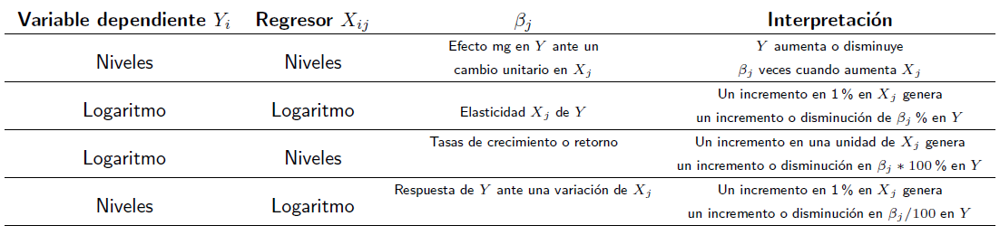
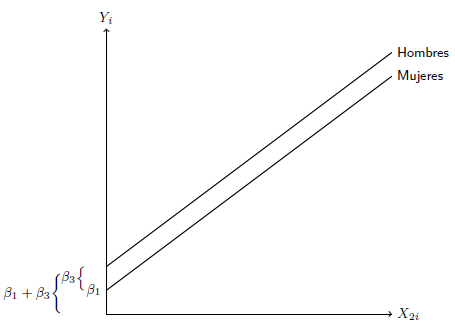

```{r setup, include = F}
# This is the recommended set up for flipbooks
# you might think about setting cache to TRUE as you gain practice --- building flipbooks from scratch can be time consuming
options(width = 70)
knitr::opts_chunk$set(
  dev.args = list(bg = 'transparent'),
  fig.width = 12, message = TRUE,
  warning = FALSE, comment = "", cache = TRUE, fig.retina = 3
)
knitr::opts_knit$set(global.par = TRUE)
Sys.setenv(`_R_S3_METHOD_REGISTRATION_NOTE_OVERWRITES_` = "false")
# remotes::install_github("luukvdmeer/sfnetworks")
# remotes::install_github("EvaMaeRey/flipbookr")
# remotes::install_github("rlesur/klippy")
# devtools::install_github("gadenbuie/xaringanExtra")
library(flipbookr)
library(xaringanthemer)
library(tidyverse)
library(klippy)
library(xaringanExtra)
library(gt); library(knitr); library(kableExtra); library(tibble)
library(summarytools); library(qrcode)
```

<style>
.notbold{
    font-weight:normal
}

body {
text-align: justify;
}

h1{
      margin-top: -1px;
      margin-bottom: -3px;
}

.small-code pre{
  margin-bottom: -10px;
  
}  

.medium-code pre{
  margin-bottom: 2px;
  
}

p.comment {
background-color: #E1E1FF;
padding: 10px;
border: 1px solid white;
margin-left: 25px;
border-radius: 15px;
text-align: center;
}
</style>

```{r xaringan-scribble, echo=FALSE}
xaringanExtra::use_scribble()
```

```{r xaringanExtra-clipboard, echo=FALSE}
htmltools::tagList(
  xaringanExtra::use_clipboard(
    button_text = "<i class=\"fa fa-clipboard\"></i>",
    success_text = "<i class=\"fa fa-check\" style=\"color: #90BE6D\"></i>",
    error_text = "<i class=\"fa fa-times-circle\" style=\"color: #F94144\"></i>"
  ),
  rmarkdown::html_dependency_font_awesome()
)
```

```{r xaringan-extra-styles, echo=FALSE}
xaringanExtra::use_extra_styles(
  hover_code_line = TRUE,         #<<
  mute_unhighlighted_code = TRUE  #<<
)
```

<font size = "5">

<br>
<br>
<br>
<br>
<br>
Link slides en formato [html](https://gusgarciacruz.github.io/EconometriaMEA/Tema6/Tema6.html)

Link slides en formato [PDF](https://gusgarciacruz.github.io/EconometriaMEA/Tema6/Tema6.pdf)

---
# <span style="font-size:80%">En este tema</span>

- <span style="font-size:150%">[<span style="color:black">Formas funcionales del modelo de RLM](#formas)</span> <br> <br>

- <span style="font-size:150%">[<span style="color:black">Variables binarias o *dummies*](#dummies)</span> <br> <br>

- <span style="font-size:150%">[<span style="color:black">Modelación de factores y categorías](#factores)</span> <br> <br>

- <span style="font-size:150%">[<span style="color:black">Ejercicio aplicado en R](#r)</span>

---
# <span style="font-size:80%">Lecturas</span>
<font size = "5">

- Wooldridge, Jeffrey (2013). *Introducción a la econometría*. 5a edición, Cengage Learning. <span style="color:blue">Cap. 2.4, 6, 7</span>

- Gujarati, D. y Porter, D. (2010). *Econometría*. 5a edición, Mc Graw Hill. <span style="color:blue">Cap. 6 y 9</span>

---
name: formas
# <span style="font-size:80%">Formas funcionales del modelo de RLM</span>
<font size = "5">

<br><br><br>

```{r, echo=FALSE, out.width="80%",fig.align='center'}

```

---
name: dummies
# <span style="font-size:80%">Variables binarias o *dummies*: conceptualización general</span>

- La inclusión de variables binarias (también llamadas *dummy* o falsas) en los modelos de regresión, obedece a la necesidad de <span style="color:blue">incorporar factores de naturaleza cualitativa</span> que se traducen en cambios paramétricos. Uno de estos cambios puede ser:

  - La ecuación de Mincer o de ingresos laborales puede ser para hombres y mujeres (diferencias en el salario de reserva por discriminación) y el log del ingreso mínimo (o intercepto) puede ser diferente para cada género
	- La demanda por carne puede variar según los grupos religiosos, las elasticidades precio e ingreso de cada grupo pueden ser diferentes
	- Un cambio estructural en el tiempo puede ser el resultado de un factor cualitativo que induce el cambio paramétrico

- Si se piensa en la función de consumo para Colombia de 1950 a 2000, es intuitivo afirmar que debido a migración campo-ciudad, transición demográfica o modernización del aparato financiero, la función de consumo de 1950 a 1970 no debe ser la misma que la correspondiente de 1971 a 2000

- El consumo autónomo (intercepto) y la propensión marginal a consumir (la pendiente) de los dos períodos puede haber cambiado. Igual sucedería con los parámetros de la función de importaciones antes y después de la apertura económica en 1990

---
# <span style="font-size:80%">Variables binarias o *dummies*: conceptualización general</span>
<font size = "5">

- La forma de incluir estos factores cualitativos es usando una variables que sólo tomen el valor 0 y 1, y se denominan falsas, dicótomas binarias o *dummies* $\Longrightarrow$ <span style="color:blue">variables indiciadores</span>

- La escogencia de 0 y 1 no es arbitraria, proviene de la esencia del conteo. Cuando se esta contando algo, se suma 1 si ese algo esta y se suma 0 si ese algo no esta

$$
\mbox{se puede asociar}=
\begin{cases}
0
& \text{Ausencia}\\
1 & \text{Presencia}
\end{cases}
$$

- Otro par de números (3 y 7 por ejemplo) no servirían para lo mismo, lo que puede ser arbitrario es la asignación del 0 y el 1

- Cuando se usan variables binarias en los modelos se producen cambios en

 - el intercepto
 - la pendiente
 - intercepto y pendiente
 
---
name: factores
# <span style="font-size:80%">Modelación de factores y categorías</span>
<font size = "5">

**<ins><span style="color:blue">i. Un factor dos categorías</span>**

Supóngase que se quiere incorporar al modelo de Mincer (ecuación salarial) el factor cualitativo género. Existen tres posibilidades según el efecto que se quiere modelar
- cambio en el intercepto (en el log del salario mínimo)
- cambio en la pendiente (en la tasa de retorno de la educación)
- cambio de ambos, intercepto y pendiente

Lo que se intenta incorporar es una hipótesis de diferenciación por género en la ecuación de ingresos. Se define una variable binaria de la forma

$$
bsexo_{i} =
\begin{cases}
 0 & \text{hombre} \\
  1 & \text{mujer}
\end{cases}
$$

---
# <span style="font-size:80%">Modelación de factores y categorías</span>
<font size = "4">

**<ins><span style="color:blue">i. Un factor dos categorías</span>**

**<span style="color:blue">1.</span>** Cambio en el intercepto<br>
Sea $lwage_{i}=$ log de los salarios y $Educ_{i2}=$ Años de educación aprobados
	
En el modelo $lwage_{i}= \beta_{1} + \beta_{2}Educ_{i} + u_{i}$
	
$\beta_{1}:$ log tasa de salario mínima<br>
$\beta_{2}:$ tasa de retorno de la educación<br>
$u_{i}:$ perturbación aleatoria con supuestos estándar
	
Al incorporar la variable binaria de género se tendría

$$lwage_{i} = \beta_{1} + \beta_{2}Educ_{i} + \beta_{3}bsexo_{i} + u_{i}$$

	
Es como si el modelo se convirtiese en dos submodelos

Mujeres $(bsexo_{i}=1)\Longrightarrow lwage_{i} = (\beta_{1}+\beta_{3}) + \beta_{2}Educ_{i} + u_{i}$<br>
Hombres $(bsexo_{i}=0\Longrightarrow lwage_{i} = \beta_{1} + \beta_{2}Educ_{i} + u_{i}$

En esta situación<br>
$\beta_{1}:$ log de la tasa salaria mínima de los hombres<br>
$\beta_{3}:$ cambio en log de la tasa salarial mínima de las mujeres respecto a los hombres<br>
$\beta_{1}+\beta_{3}:$ log de la tasa salarial mínima de las mujeres

---
# <span style="font-size:80%">Modelación de factores y categorías</span>
<font size = "4">

**<ins><span style="color:blue">i. Un factor dos categorías</span>**

**<span style="color:blue">1.</span>** Cambio en el intercepto<br>

Gráficamente tenemos

```{r, echo=FALSE, out.width="45%",fig.align='center'}

```

Lo que se esta modelando es un cambio en el intercepto manteniendo constante la pendiente

Lo que se hizo fue conservar el intercepto $(\beta_{1})$ y agregar una variable falsa $(bsexo_{i})$

---
# <span style="font-size:80%">Modelación de factores y categorías</span>
<font size = "4">

**<ins><span style="color:blue">i. Un factor dos categorías</span>**

**<span style="color:blue">1.</span>** Cambio en el intercepto<br>

Alternativamente se puede eliminar el intercepto e incluir dos variables binarias

.pull-left[
$$
bmujer_{i} =
\begin{cases}
0 & \text{Hombre} \\\
1 & \text{Mujer}
\end{cases}
$$ 
]

.pull-right[
$$
bhombre_{i} =
\begin{cases}
0
& \text{Mujer} \\
1 & \text{Hombre}
\end{cases}
$$
]

<br>
Observe que $bhombre_{i}+bmujer_{i}=1$	

El modelo queda de la forma

$$lwage_{i} = \gamma_{2}Educ_{i2}+\gamma_{3}bhombre_{i}+\gamma_{4}bmujer_{i}+u_{i}$$
Nuevamente se tienen dos modelos<br>
Mujeres $(bhombre_{i}=0, bmujer_{i}=1)\Longrightarrow lwage_{i} = \gamma_{4} + \gamma_{2}Educ_{i2} + u_{i}$<br>
Hombres $(bhombre_{i}=1, bmujer_{i}=0)\Longrightarrow lwage_{i} = \gamma_{3} + \gamma_{2}Educ_{i2} + u_{i}$
	
En esta situación\\
$\gamma_{2}:$ tasa de retorno de la educación, se supone igual para hombres y mujeres<br>
$\gamma_{3}:$ log de la tasa salarial mínima para hombres<br>
$\gamma_{4}:$ log de la tasa salarial mínima para mujeres<br>
$\gamma_{4}-\gamma_{3}:$ diferencial del log de la tasa mínima de salario de mujeres frente a hombres

---
# <span style="font-size:80%">Modelación de factores y categorías</span>
<font size = "4">

**<ins><span style="color:blue">i. Un factor dos categorías</span>**
<p style="margin-bottom: -0.5em">
**<span style="color:blue">1.</span>** Cambio en el intercepto<br>
Qué sucede si se utilizan las dos opciones anteriores al mismo tiempo:  conservar el intercepto e incluir las dos variables binarias
<p style="margin-bottom: -1em">
$$lwage_{i} = \gamma_{1} + \gamma_{2}Educ_{i} + \gamma_{3}bhombre_{i} + \gamma_{4}bmujer_{i} + u_{i}$$
La matriz $\textbf{X}$ del modelo tendría la siguiente estructura (suponemos primero mujeres $(M)$ y después hombres $(N-M)$)

$$ \textbf{X}\_{N\mbox{x}4} = \left[ \begin{array}{cccc} 
1      & Educ\_{1}   & 0      & 1   \\\
1      & \vdots      & 0      & 1 \\\
1      & Educ\_{M}   & 0      & 1 \\\
\ldots & \ldots      & \ldots & \ldots \\\
1      & Educ\_{M+1} & 1      & 0 \\\
1      & \vdots      & 1      & 0 \\\
1      & Educ\_{N}   & 1      & 0 \\\
\end{array}\right]$$ 
<p style="margin-bottom: -1em">
Se observa que Col(1)=Col(3)+Col(4), lo cual implica que rango de la matriz $\textbf{X}$ no es de 4 sino de 3, así que hay un problema de <span style="color:blue">multicolinealidad perfecta</span>:

$$(X'X)_{4\mbox{x}4} \mbox{ es singular}$$
$$(X'X)_{4\mbox{x}4}^{-1} \mbox{ no existe}$$
Este caso se conoce como **<span style="color:blue">la trampa de las variables *dummies*</span>**

---
# <span style="font-size:80%">Modelación de factores y categorías</span>
<font size = "5">

**<ins><span style="color:blue">i. Un factor dos categorías</span>**

**<span style="color:blue">2.</span>** Cambio en pendiente<br>
La manera de incorporar cambios en la pendiente es agregar el producto de la variable binaria por la correspondiente variable explicativa. Por ejemplo, modelando diferentes tasas de retornos a la educación por género, el modelo queda de la forma:

$$lwage_{i}=\beta_{1}+\beta_{2}Educ_{i}+\beta_{3}Educ_{i}bsexo_{i}+u_{i}$$
Nuevamente es un modelo que contiene dos<br>
Hombres $(bsexo_{i}=0)\Longrightarrow lwage_{i} = \beta_{1} + \beta_{2}Educ_{i} + u_{i}$<br>
Mujeres $(bsexo_{i}=1)\Longrightarrow lwage_{i} = \beta_{1} + (\beta_{2}+\beta_{3})Educ_{i} + u_{i}$
	
En esta situación<br>
$\beta_{1}:$ log de la tasa salarial mínima, se supone igual para hombres y mujeres<br>
$\beta_{2}:$ tasa de retorno de la educación de las mujeres<br>
$\beta_{3}:$ cambio en la tasa de retorno de la educación de hombres respecto a mujeres<br>
$\beta_{2}+\beta_{3}:$ tasa de retorno de la educación de los hombres

---
# <span style="font-size:80%">Modelación de factores y categorías</span>
<font size = "4">

**<ins><span style="color:blue">i. Un factor dos categorías</span>**

**<span style="color:blue">3.</span>** Cambio en el intercepto y la pendiente<br>

La intuición indica que se debe reunir los dos casos anteriores: agregar una variable binaria (o eliminar el intercepto y agregar dos binarias) y la binaria multiplicada por la variable independiente. El modelo queda de la forma:
	
$$lwage_{i}=\beta_{1}+\beta_{2}Educ_{i}+\beta_{3}bsexo_{i}+\beta_{4}Educ_{i}bsexo_{i}+u_{i}$$
Hombres $(bsexo_{i}=0)\Longrightarrow Y_{i} = \beta_{1} + \beta_{2}X_{i2} + u_{i}$<br>
Mujeres $(bsexo_{i}=1)\Longrightarrow Y_{i} = (\beta_{1}+\beta_{3}) + (\beta_{2}+\beta_{4})X_{i2} + u_{i}$	
	
En esta situación<br>
$\beta_{1}:$ log de la tasa salarial mínima de las mujeres<br>
$\beta_{2}:$ tasa de retorno de la educación de las mujeres<br>
$\beta_{3}:$ cambio en log de la tasa salarial mínima de hombres respecto a mujeres<br>
$\beta_{4}:$ cambio en la tasa de retorno de la educación de hombres respecto a mujeres<br>
$\beta_{1}+\beta_{3}:$ log de la tasa salarial mínima de los hombres<br>
$\beta_{2}+\beta_{4}:$ Tasa de retorno de la educación de los hombres

<span style="color:blue">El modelo conjunto es equivalente a estimar dos regresiones por separado

---
# <span style="font-size:80%">Modelación de factores y categorías</span>
<font size = "4">

**<ins><span style="color:blue">ii. Un factor varias categorías</span>**<br>
Se tienen tres niveles educatiovs, así que se definen las siguientes variables binarias

.pull-left[
$$
bpri_{i} =
\begin{cases}
1 & \text{primaria } \\\
0 & \text{otro caso } 
\end{cases}
$$ 
]

.pull-left[
$$
bsec_{i} =
\begin{cases}
1 & \text{secundaria } \\
0 & \text{otro caso }
\end{cases}
$$
]

.pull-left[
$$
bsup_{i} =
\begin{cases}
1 & \text{superior } \\
0 & \text{otro caso }
\end{cases}
$$
]

En el modelo de RLM se conserva el intercepto y al haber 3 categorías se incluyen 2 variables binarias. La categoría a la cual no se le incluye la variable binaria se vuelve el patrón de referencia del modelo. El modelo queda de la forma: 

$$lwage_{i}=\beta_{1}+\beta_{2}Exper_{i}+\beta_{3}bsec_{i}+\beta_{4}bsup_{i}+u_{i}$$
El modelo incluye 3 submodelos:<br>
Secundaria $(bsec_{i}=1, bsup_{i}=0)\Longrightarrow lwage_{i} = (\beta_{1}+\beta_{3}) + \beta_{2}Exper_{i} + u_{i}$<br>
Superior $(bsec_{i}=0, bsup_{i}=1)\Longrightarrow lwage_{i} = (\beta_{1}+\beta_{4}) + \beta_{2}Exper_{i2} + u_{i}$<br>
Primaria $(bsec_{i}=0, bsup_{i}=0)\Longrightarrow lwage_{i} = \beta_{1} + \beta_{2}Exper_{i2} + u_{i}$	
	
En esta situación<br>
$\beta_{1}:$ log de la tasa salarial mínima de los individuos con primaria<br>
$\beta_{2}:$ tasa de retorno de la experiencia, asumida igual independiente del nivel educativo<br>
$\beta_{3}:$ diferencia en log de la tasa salarial mínima de individuos con secundaria respecto a los de primaria<br>
$\beta_{4}:$ diferencia en log de la tasa salarial mínima de individuos con superior respecto a los de primaria<br>
$\beta_{1}+\beta_{3}:$ log de la tasa salarial mínima de los individuos con secundaria<br>
$\beta_{1}+\beta_{4}:$ log de la tasa salarial mínima de los individuos con superior

---
# <span style="font-size:80%">Ejemplo aplicado en R</span>
<font size = "4">
Se tiene una base de datos de corte transversal de 526 trabajadores correspondientes a 1976 para los Estados unidos. $wage$ son los salarios en dólares por hora y $educ$ los años de educación

**<ins><span style="color:blue">i. Un factor dos categorías</span>**<br>
<span style="color:blue">1.</span> Cambio en el intercepto (intercepto + una binaria)

$$lwage = \beta_{1} + \beta_{2}educ + \beta_{3}female + u$$
$$
female_{i} =
\begin{cases}
1 & \text{mujer} \\
0 & \text{hombre}
\end{cases}
$$
```{r}
library(haven); library(tidyverse); library(summarytools)
data <- read_stata("http://fmwww.bc.edu/ec-p/data/wooldridge/wage1.dta")

modelo1 <- lm(lwage ~ educ + female, data=data)
summary(modelo1)
```

---
# <span style="font-size:80%">Ejemplo aplicado en R</span>
<font size = "4">
**<ins><span style="color:blue">i. Un factor dos categorías</span>**<br>
<span style="color:blue">1.</span> Cambio en el intercepto (no intercepto y dos binarias)

.pull-left[
$$
female_{i} =
\begin{cases}
1 & \text{mujer} \\\
0 & \text{hombre} 
\end{cases}
$$ 
]

.pull-left[
$$
male_{i} =
\begin{cases}
1 & \text{hombre} \\
0 & \text{mujer}
\end{cases}
$$
]

<br><br><br><br>

```{r}
data <- read_stata("http://fmwww.bc.edu/ec-p/data/wooldridge/wage1.dta") |> 
  mutate(male = case_when(female==1~0,
                          female==0~1))

modelo2 <- lm(lwage ~ 0 + educ + female + male , data=data)
summary(modelo2)
```

---
# <span style="font-size:80%">Ejemplo aplicado en R</span>
<font size = "4">
**<ins><span style="color:blue">i. Un factor dos categorías</span>**<br>
<span style="color:blue">2.</span> Cambio en pendiente

$$lwage = \beta_{1} + \beta_{2}educ + \beta_{3}educ*female + u$$

```{r}
modelo3 <- lm(lwage ~ educ + educ:female, data=data)
summary(modelo3)
```

---
# <span style="font-size:80%">Ejemplo aplicado en R</span>
<font size = "4">
**<ins><span style="color:blue">i. Un factor dos categorías</span>**<br>
<span style="color:blue">2.</span> Cambio en intercepto y pendiente

$$lwage = \beta_{1} + \beta_{2}educ + \beta_{3}female + \beta_{4}educ*female + u$$

```{r}
modelo4 <- lm(lwage ~ educ + educ*female, data=data)
summary(modelo4)
```

---
# <span style="font-size:80%">Ejemplo aplicado en R</span>
<font size = "4">
**<ins><span style="color:blue">i. Un factor dos categorías</span>**<br>
<span style="color:blue">2.</span> Cambio en intercepto y pendiente

Lo anterior es equivalente a estimar dos regresiones por separado, una cuando $female=1$ y otra cuando $female=0$

.pull-left-50[
```{r}
modelo5 <- lm(lwage ~ educ, data=subset(data,female==1))
summary(modelo5)
```
]
.pull-right-50[
```{r}
modelo6 <- lm(lwage ~ educ, data=subset(data,female==0))
summary(modelo6)
```
]

---
# <span style="font-size:80%">Ejemplo aplicado en R</span>
<font size = "4">
**<ins><span style="color:blue">ii. Un factor varias categorías</span>**

$$lwage = \beta_{1} + \beta_{2}exper + \beta_{3}bsec + \beta_{4}bsup + u$$

.pull-left[
$$
bpri_{i} =
\begin{cases}
1 & \text{primaria } \\\
0 & \text{otro caso } 
\end{cases}
$$ 
]

.pull-left[
$$
bsec_{i} =
\begin{cases}
1 & \text{secundaria } \\
0 & \text{otro caso }
\end{cases}
$$
]

.pull-left[
$$
bsup_{i} =
\begin{cases}
1 & \text{superior } \\
0 & \text{otro caso }
\end{cases}
$$
]

.pull-left-50[
```{r}
freq(data$educ, headings=F)
```
]

.pull-right-50[
```{r}
data <- data |> 
  mutate(educ_n = case_when(educ>=0 & educ<=5 ~ 1,
                            educ>=6 & educ<=13 ~ 2,
                            educ>=14 & educ<=18 ~ 3))
freq(data$educ_n, headings=F)
```
]

---
# <span style="font-size:80%">Ejemplo aplicado en R</span>
<font size = "5">
**<ins><span style="color:blue">ii. Un factor varias categorías</span>**

.pull-left-50[
```{r}
modelo7 <- lm(lwage ~ exper + factor(educ_n), data=data)
summary(modelo7)
```
]

.pull-right-50[
```{r}
data <- data |> 
  mutate(bpri = case_when(educ>=0 & educ<=5 ~ 1,
                          TRUE ~ 0),
         bsec = case_when(educ>=6 & educ<=13 ~ 1,
                          TRUE ~ 0),
         bsup = case_when(educ>=14 & educ<=18 ~ 1,
                          TRUE ~ 0))

modelo8 <- lm(lwage ~ exper + bsec + bsup, data=data)
summary(modelo8)
```

]