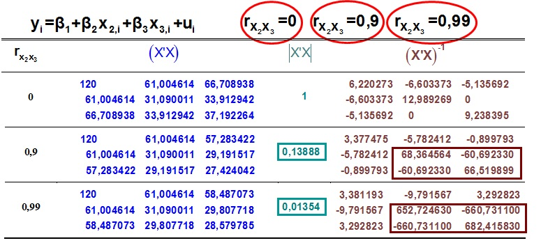

```{r setup, include = F}
# This is the recommended set up for flipbooks
# you might think about setting cache to TRUE as you gain practice --- building flipbooks from scratch can be time consuming
options(width = 70)
knitr::opts_chunk$set(
  dev.args = list(bg = 'transparent'),
  fig.width = 12, message = TRUE,
  warning = FALSE, comment = "", cache = TRUE, fig.retina = 3
)
knitr::opts_knit$set(global.par = TRUE)
Sys.setenv(`_R_S3_METHOD_REGISTRATION_NOTE_OVERWRITES_` = "false")
# remotes::install_github("luukvdmeer/sfnetworks")
# remotes::install_github("EvaMaeRey/flipbookr")
# remotes::install_github("rlesur/klippy")
# devtools::install_github("gadenbuie/xaringanExtra")
library(flipbookr)
library(xaringanthemer)
library(tidyverse)
library(klippy)
library(xaringanExtra)
library(gt); library(knitr); library(kableExtra); library(tibble)
library(summarytools); library(qrcode)
```

<style>
.notbold{
    font-weight:normal
}

body {
text-align: justify;
}

h1{
      margin-top: -1px;
      margin-bottom: -3px;
}

.small-code pre{
  margin-bottom: -10px;
  
}  

.medium-code pre{
  margin-bottom: 2px;
  
}

p.comment {
background-color: #E1E1FF;
padding: 10px;
border: 1px solid white;
margin-left: 25px;
border-radius: 15px;
text-align: center;
}
</style>

```{r xaringan-scribble, echo=FALSE}
xaringanExtra::use_scribble()
```

```{r xaringanExtra-clipboard, echo=FALSE}
htmltools::tagList(
  xaringanExtra::use_clipboard(
    button_text = "<i class=\"fa fa-clipboard\"></i>",
    success_text = "<i class=\"fa fa-check\" style=\"color: #90BE6D\"></i>",
    error_text = "<i class=\"fa fa-times-circle\" style=\"color: #F94144\"></i>"
  ),
  rmarkdown::html_dependency_font_awesome()
)
```

```{r xaringan-extra-styles, echo=FALSE}
xaringanExtra::use_extra_styles(
  hover_code_line = TRUE,         #<<
  mute_unhighlighted_code = TRUE  #<<
)
```

<font size = "5">

<br>
<br>
<br>
<br>
<br>
Link slides en formato [html](https://gusgarciacruz.github.io/EconometriaMEA/Tema7/Tema7.html)

Link slides en formato [PDF](https://gusgarciacruz.github.io/EconometriaMEA/Tema7/Tema7.pdf)

---
# <span style="font-size:80%">En este tema</span>

- <span style="font-size:150%">[<span style="color:black">Naturaleza del problema](#naturaleza)</span> <br>

- <span style="font-size:150%">[<span style="color:black">Multicolinealidad perfecta](#perfecta)</span> <br>

- <span style="font-size:150%">[<span style="color:black">Ausencia total de multicolinealidad (ortogonalidad)](#ausencia)</span> <br>

- <span style="font-size:150%">[<span style="color:black">Multicolinealidad imperfecta](#imperfecta)</span> <br>

- <span style="font-size:150%">[<span style="color:black">Consecuencias](#consecuencias)</span> <br>

- <span style="font-size:150%">[<span style="color:black">Criterios para detectar multicolinealidad](#criterios)</span> <br>

- <span style="font-size:150%">[<span style="color:black">Medidas correctivas](#medidas)</span> <br>

- <span style="font-size:150%">[<span style="color:black">Ejercicio aplicado en R](#r)</span>

---
# <span style="font-size:80%">Lecturas</span>
<font size = "5">

- Wooldridge, Jeffrey (2013). *Introducción a la econometría*. 5a edición, Cengage Learning. <span style="color:blue">Cap. 3.4</span>

- Gujarati, D. y Porter, D. (2010). *Econometría*. 5a edición, Mc Graw Hill. <span style="color:blue">Cap. 10</span>

---
name: naturaleza
# <span style="font-size:80%">Naturaleza del problema</span>
<font size = "5">

- La multicolinealidad es un problema de <span style="color:blue">dependencia lineal entre las variables explicatorias que obstaculizan el poder aislar el efecto de cada una por separado</span>

- Su principal efecto serán varianzas excesivamente grandes para cada estimador, y esto llevará a que cada parámetro pueda estar mal estimado

- No obstante:
<p style="margin-bottom: -1em">
  - alta depencencia no necesariamente lleva a molestias
	- en presencia de molestias para cada parámetro, una combinación lineal puede estar bien estimada
	- puede haber una contradicción estadística: <span style="color:blue">por separado ningún parámetro significativo pero de conjunto si lo son
	
---
# <span style="font-size:80%">Naturaleza del problema</span>
<font size = "5">

Lo primero que hay que tener en cuenta es que es un problema muestral, al ser consecuencia de excesiva dependencia entre las $X$

Se pueden distinguir tres situaciones:
- <span style="color:blue">Multicolinealidad perfecta

- <span style="color:blue">Ausencia total de multicolinealidad (Ortogonalidad)

- <span style="color:blue">multicolinealidad imperfecta

---
name: perfecta
# <span style="font-size:80%">Multicolinealidad perfecta</span>
<font size = "5">

Representa la violación del supuesto de rango completo de la matriz $\textbf{X}_{n\mbox{x}k}$

<center>
Si $\rho(\textbf{X}_{n\mbox{x}k})<k$<br>

$|\textbf{X}'\textbf{X}|=0$<br>

$(\textbf{X}'\textbf{X})$ es matriz singular<br>

$(\textbf{X}'\textbf{X})^{-1}$ no existe<br>

$\widehat{\textbf{B}}=(\textbf{X}'\textbf{X})^{-1} \textbf{X}'\textbf{Y}$ no se puede calcular<br>

$Cov(\widehat{\textbf{B}})=\widehat{\sigma}_u^2 (\textbf{X}'\textbf{X})^{-1}$ no se puede calcular

<p align="justify">
La trampa de las variables binarias es un ejemplo de multicolinealidad perfecta, en este caso por una incorrecta especificación del modelo

---
# <span style="font-size:80%">Multicolinealidad perfecta</span>
<spam style="font-size:120%">

Supóngase un modelo de 2 variables

$$Y_{i} = \beta_{1} + \beta_{2}X_{2i} + \beta_{3}X_{3i} + u_{i}$$
Así que la matriz $\textbf{X}'\textbf{X}$ será

$$\textbf{X}'\textbf{X} = \left( \begin{array}{ccc}
n           & \sum X_{2i} & \sum X_{3i}\\
\sum X_{2i} & \sum X_{2i}^2 & \sum X_{2i}X_{3i}\\
\sum X_{3i} & \sum X_{2i}X_{3i} & \sum X_{3i}^2\\ \end{array} \right)$$

Si se diese el caso que $X_{3i} = qX_{2i}$ entonces el $\rho(\textbf{X}_{n\mbox{x}3})=2$, entonces se tendría

$$\textbf{X}'\textbf{X} = \left( \begin{array}{ccc}
n & \sum X_{2i} & q\sum X_{2i} \\
\sum X_{2i} & \sum X_{2i}^2 & q\sum X_{2i}^2 \\
q\sum X_{2i} & q\sum X_{2i}^2 & q^2 \sum X_{2i}^2\\  \end{array} \right)$$

Se observa que la 3a columna de $\textbf{X}'\textbf{X}$ es $q$ veces la 2a, por lo tanto los datos muestrales no permiten estimar el modelo planteado

---
# <span style="font-size:80%">Multicolinealidad perfecta</span>
<font size = "5">

En efecto 

$$Y_{i} = \beta_{1} + \beta_{2}X_{2i} + \beta_{3}qX_{2i} + u_{i}$$
$$Y_{i} = \beta_{1} + (\beta_{2}+q\beta_{3})X_{2i} + u_{i}$$
La muestra contiene información para estimar $\beta_1$ y $\beta_{2}+q\beta_{3}$, pero no hay suficiente información para estimar $\beta_{2}$ y $\beta_{3}$ por separado
	
<span style="color:blue">En este caso extremo de multicolinealidad perfecta el modelo $\textbf{Y} = \textbf{X}\textbf{B} + \textbf{u}$ no puede ser estimado</span>. Si es consecuencia de una incorrecta especificación el único camino es re-especificar el modelo

---
name: ausencia
# <span style="font-size:80%">Ausencia total de multicolinealidad (ortogonalidad)</span>
<spam style="font-size:110%">

En el otro extremo está la ausencia total de interdependencia entre regresores. Es el caso de la <span style="color:blue">ortogonalidad</span>: <span style="color:blue">como la variable $X_{j}$ es totalmente independiente de otra $X_{m}$, su producto vectorial será nulo $X_{j}'X_{m}=0$</span>. Este es el mejor caso para estimar $\beta_j$, pero rara vez sucede
	
Si la correlación entre los regresores es $0$, el estimador MCO, $\widehat{\textbf{B}}=(\textbf{X}'\textbf{X})^{-1}\textbf{X}'\textbf{Y}$, equivale a esta expresión:

$$\left[ \begin{array}{c}
\widehat{\beta}_{2} \\ 
\\
\widehat{\beta}_{3}\\ \end{array} \right] = \left[ \begin{array}{c}
\frac{\sum (X_{2i}-\bar{X}_{2})(Y_{i}-\bar{Y})}{\sum (X_{2i}-\bar{X}_{2})^2} \\
\\
\frac{\sum (X_{3i}-\bar{X}_{3})(Y_{i}-\bar{Y})}{\sum (X_{3i}-\bar{X}_{3})^2} \\ \end{array} \right]$$

- La matriz $(\textbf{X}'\textbf{X})$ se convierte en una matriz diagonal, se pierde la componente de covarianza entre los regresores por la incorrelación los mismos 

- Las estimaciones del modelo múltiple coinciden con la de dos modelos simples por separado

- Los valores de la varianza si varían puesto que $\widehat{\sigma}_{u}^2$ depende del número de regresores utilizados: $\widehat{\sigma}_{u}^2 = \frac{\widehat{\textbf{u}}'\widehat{\textbf{u}}}{N-k}$ y $Cov(\widehat{\textbf{B}}) = \widehat{\sigma}_{u}^2 (\textbf{X}'\textbf{X})^{-1}$ 

- Difícilmente se da en la práctica

---
name: imperfecta
# <span style="font-size:80%">Multicolinealidad imperfecta</span>
<font size = "4">

En este caso existe una altísima dependencia entre regresores mas no es una relación exacta

En algunos casos el origen está en el movimiento conjunto de algunas variables. Es el caso de ciertas series temporales macroeconómicas. En otros casos, el origen puede estar en la construcción del modelo: si se incluyen cuadrados y productos cruzados, además de los regresores lineales, como en la función translog o en la ecuación de mincer

Es la situación más habitual en la práctica. Se cumple la condición de rango: 
<center>
$\rho(\textbf{X}_{n\mbox{x}k})=k$<br>
$|\textbf{X}'\textbf{X}|\neq0$<br>
$(\textbf{X}'\textbf{X})$ es una matriz no singular<br>
$(\textbf{X}'\textbf{X})^{-1}$ existe


```{r, echo=FALSE, out.width="60%",fig.align='center'}

```

---
name: consecuencias
# <span style="font-size:80%">Consecuencias de la multicolinealidad imperfecta</span>
<font size = "5">

1. Hay pérdida de precisión en la estimación individual de los parámetros

2. Como consecuencia de la mayor varianza habrán intervalos de confianza más amplios y más tendencias al no rechazo de $H_0:\beta_{j}=0$. No obstante la prueba en su conjunto no se verá afectada

3. Si como consecuencia del no rechazo de $\beta_{j}=0$ se elimina $X_{ji}$, puede ocurrir un sesgo en la estimación del resto de parámetros

4. Excesiva sensibilidad muestral

---
name: criterios
# <span style="font-size:80%">Criterios para detectar multicolinealidad</span>
<font size = "5">

- La multicolinealidad es una cuestión de grado y no de clase. La distinción importante no es entre presencia o ausencia de multicolinealidad, sino entre sus diferentes grados

- Como la multicolinealidad se refiere a la condición de las variables explicativas que son no estocásticas por supuestos, es una característica de la muestra y no de la población  

Por consiguiente, no es necesario "llevar a cabo pruebas sobre multicolinealidad", pero, si se desea, es posible medir su grado en cualquier muestra determinada

No existe un método único para detectar o medir la fuerza de la multicolinealidad. Lo que se tiene son ciertas reglas prácticas, algunas informales y otras formales, pero todas reglas prácticas

---
# <span style="font-size:80%">Criterios para detectar multicolinealidad</span>
<spam style="font-size:120%">

- Diagrama de dispersión: permite observar cómo se relacionan las diversas variables de un modelo de regresión
	
- Un $R^2$ elevado o significancia conjunta del modelo y pocas razones $t$ significativas

- Altas correlaciones entre parejas de regresores

- Regresiones auxiliares y calculo de $R_{j}^2$

- La regla práctica de Klein: la multicolinealidad puede ser un problema complicado solamente si el $R^2$ de una regresión auxiliar es mayor que el $R^2$ de la regresión de $Y$ sobre todos los regresores

- Factor inflacionario de la varianza (FIV)
<center>	
$Var(\widehat{\beta}_j) = \frac{\widehat{\sigma}_{u}^2}{\sum x_{ji}^2 (1-R_{j}^2)}  = \frac{\widehat{\sigma}_{u}^2}{\sum x_{ji}^2} FIV_{j}$, donde $FIV_{j}=\frac{1}{1-R_{j}^2}$

La regla práctica es: si el $FIV$ de una variable es superior a 10 (esto sucede si $R_{j}^2$ excede 0.90), se dice que esa variable es muy colineal

---
name: medidas
# <span style="font-size:80%">Medidas correctivas</span>
<font size = "5">

- La multicolinealidad es en esencia un problema de deficiencia de datos, y en algunas ocasiones no hay opción respecto de los datos disponibles para el análisis empírico

- Procedimiento de reglas prácticas
	- Información *a priori*
	
	- Combinación de información de corte transversal y de series de tiempo
	
	- Eliminación de una(s) variable(s) y el sesgo de especificación
	
	- Transformación de variables
	
	- Datos nuevos o adicionales
	
---
name: r
# <span style="font-size:80%">Ejercicio aplicado en R</span>
<font size = "5">

Los datos para este ejercicio fueron extraidos de *the 1974 Motor Trend US magazine*, y contiene información sobre consumo de gasolina y 10 características del diseño y desempeño de 32 automóviles.

Se dispone de las siguientes varibles:  
- mpg: Miles/(US) gallon
- disp:	Displacement (cu.in.)
- hp:	Gross horsepower
- wt:	Weight (1000 lbs)
- qsec:	1/4 mile time

La idea es analizar los determinantes del desempeño de los automóviles y se estima la siguiente ecuación:

$$mpg_i = \beta_1 + \beta_2 disp_i + \beta_3 hp_i + \beta_4 wt + \beta_5 qsec + u_i$$

---
# <span style="font-size:80%">Ejercicio aplicado en R</span>
.pull-left-50[
```{r}
library(Hmisc); library(corrplot); library(olsrr); library('mctest')
data(mtcars)
model <- lm(mpg ~ disp + hp + wt + qsec, data = mtcars)
summary(model)
```
]
.pull-right-50[
```{r}
# Matriz de correlaciones parciales y su significancia estadística
subdata <- mtcars[,c("disp",  "hp", "wt", "qsec")]
cor(subdata)
cor <- cor(mtcars[,c("disp",  "hp", "wt", "qsec")])
cor
# Correlaciones con significancia estadística
rcorr(as.matrix(subdata))
cor2<-rcorr(as.matrix(subdata))
```
]

---
# <span style="font-size:80%">Ejercicio aplicado en R</span>

.pull-left-50[
```{r}
# Corrplot function
corrplot(cor, type="upper", order = "hclust",tl.col = "black",
         tl.srt = 45, sig.level = 0.05, insig = "blank")
```
]

.pull-right-50[
```{r}
# Diagrama de dispersión
plot(subdata, col = "dodgerblue")
```
]

---
# <span style="font-size:80%">Ejercicio aplicado en R</span>
.pull-left-50[
```{r}
# FIV
# vif: factor de inflación de la varianza (FIV). VIF mayores a 10 son preocupamtes. La otra media que aparece es
# la tolerancia = 1/vif. Tolerancia más bajo que 0.1 es comparable a un VIF de 10

ols_vif_tol(model)
```
]

.pull-right-50[
```{r}
ols_coll_diag(model)
```
]

---
# <span style="font-size:80%">Ejercicio aplicado en R</span>
```{r}
# Otro paquete para hacer diagnóstico de colinealidad es mctest
# Leer https://journal.r-project.org/archive/2016/RJ-2016-062/RJ-2016-062.pdf para entender cada estadístico del paquete
#omcdiag(model)
#imcdiag(model)
#imcdiag(model, corr=T)
#imcdiag(model, corr=T, all=TRUE)
#mctest(model, all=TRUE)
mc.plot(model)

```

---
# <span style="font-size:80%">Ejercicio aplicado en R</span>
.pull-left-50[
```{r}
# Solución: eliminar disp 
model1 <- lm(mpg ~ hp + wt + qsec, data = mtcars)
summary(model1)
imcdiag(model1, corr=T)
```
]

.pull-right-50[
```{r}
# hp y qsec tienen alta correlación, se podría eliminar qsec
model2 <- lm(mpg ~ hp + wt, data = mtcars)
summary(model2)
imcdiag(model2, corr=T)
```
]
