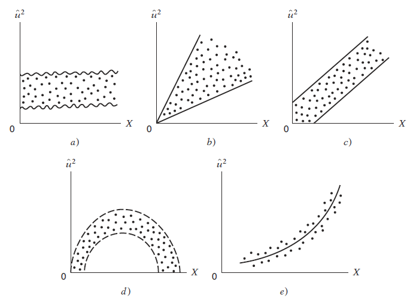

```{r setup, include = F}
# This is the recommended set up for flipbooks
# you might think about setting cache to TRUE as you gain practice --- building flipbooks from scratch can be time consuming
options(width = 70)
knitr::opts_chunk$set(
  dev.args = list(bg = 'transparent'),
  fig.width = 12, message = TRUE,
  warning = FALSE, comment = "", cache = TRUE, fig.retina = 3
)
knitr::opts_knit$set(global.par = TRUE)
Sys.setenv(`_R_S3_METHOD_REGISTRATION_NOTE_OVERWRITES_` = "false")
# remotes::install_github("luukvdmeer/sfnetworks")
# remotes::install_github("EvaMaeRey/flipbookr")
# remotes::install_github("rlesur/klippy")
# devtools::install_github("gadenbuie/xaringanExtra")
library(flipbookr)
library(xaringanthemer)
library(tidyverse)
library(klippy)
library(xaringanExtra)
library(gt); library(knitr); library(kableExtra); library(tibble)
library(summarytools); library(qrcode)
```

<style>
.notbold{
    font-weight:normal
}

body {
text-align: justify;
}

h1{
      margin-top: -1px;
      margin-bottom: -3px;
}

.small-code pre{
  margin-bottom: -10px;
  
}  

.medium-code pre{
  margin-bottom: 2px;
  
}

p.comment {
background-color: #E1E1FF;
padding: 10px;
border: 1px solid white;
margin-left: 25px;
border-radius: 15px;
text-align: center;
}
</style>

```{r xaringan-scribble, echo=FALSE}
xaringanExtra::use_scribble()
```

```{r xaringanExtra-clipboard, echo=FALSE}
htmltools::tagList(
  xaringanExtra::use_clipboard(
    button_text = "<i class=\"fa fa-clipboard\"></i>",
    success_text = "<i class=\"fa fa-check\" style=\"color: #90BE6D\"></i>",
    error_text = "<i class=\"fa fa-times-circle\" style=\"color: #F94144\"></i>"
  ),
  rmarkdown::html_dependency_font_awesome()
)
```

```{r xaringan-extra-styles, echo=FALSE}
xaringanExtra::use_extra_styles(
  hover_code_line = TRUE,         #<<
  mute_unhighlighted_code = TRUE  #<<
)
```

<font size = "5">

<br>
<br>
<br>
<br>
<br>
Link slides en formato [html](https://gusgarciacruz.github.io/EconometriaMEA/Tema8/Tema8.html)

Link slides en formato [PDF](https://gusgarciacruz.github.io/EconometriaMEA/Tema8/Tema8.pdf)

---
# <span style="font-size:80%">En este tema</span>

- <span style="font-size:150%">[<span style="color:black">Generalidades](#generalidades)</span> <br>

- <span style="font-size:150%">[<span style="color:black">Tipos frecuentes de heteroscedasticidad](#tipos)</span> <br>

- <span style="font-size:150%">[<span style="color:black">Criterios para detectar heteroscedasticidad](#criterios)</span> <br>

- <span style="font-size:150%">[<span style="color:black">Estimación por Mínimos Cuadrados Ponderados (MCP)](#mcp)</span> <br>

- <span style="font-size:150%">[<span style="color:black">La función de heteroscedasticidad debe ser estimada: MCG factibles](#mcg)</span> <br>

- <span style="font-size:150%">[<span style="color:black">Inferencia robusta a la heteroscedasticidad](#inferencia)</span> <br>

- <span style="font-size:150%">[<span style="color:black">Ejercicio aplicado en R](#r)</span>

---
# <span style="font-size:80%">Lecturas</span>
<font size = "5">

- Wooldridge, Jeffrey (2013). *Introducción a la econometría*. 5a edición, Cengage Learning. <span style="color:blue">Cap. 8</span>

- Gujarati, D. y Porter, D. (2010). *Econometría*. 5a edición, Mc Graw Hill. <span style="color:blue">Cap. 11</span>

---
name: generalidades
# <span style="font-size:80%">Generalidades</span>
<font size = "5">

- El modelo de regresión visto hasta ahora descansa sobre varios supuestos:
	- la forma funcional del modelo es adecuada
	- todas las variables explicativas relevantes son incluidas
	- las variables explicativas son exogenas
	- los supuestos sobre el termino de perturbación se cumplen
	
	
- Nos cuestionamos ahora sobre estos últimos supuestos, en particular

<center>
		<span style="color:blue">Qué pasa si el error de la varianza no es constante para cada observación?<br><br>
		
		<span style="color:blue">Se puede detectar una varianza cambiante y si es así, es necesario ajustar el procedimiento de estimación si tal detección ocurre?
</center>

---
# <span style="font-size:80%">Generalidades</span>
<spam style="font-size:120%">

<ins>**<span style="color:blue">Covarianza del error no escalar**

Se ha trabajado con el siguiente modelo:

$$Y_{i} = \beta_{1} + \beta_{2}X_{i2} + \beta_{3}X_{i3} + ... + \beta_{k}X_{ik} + u_{i}$$
o, en notación matricial

$$\textbf{Y} = \textbf{X}\textbf{B} + \textbf{u}$$
Donde los términos de error $u_{i}$ se han asumido a ser variables aleatorias incorrelacionadas, cada una con media cero e idéntica (constante) varianza $\sigma_{u}^2$. En notación matricial los supuestos son:

$$E(\textbf{u})=0$$
$$Cov(\textbf{u})=E(\textbf{u}\textbf{u}')=\sigma_{u}^2\textbf{I}$$
$$\textbf{u}\sim N(0,\sigma_{u}^2\textbf{I})$$
La pregunta es entonces bajo qué circunstancias el supuesto de perturbaciones esféricas es violado: <span style="color:blue">autocorrelación</span> y <span style="color:blue">heteroscedasticidad</span>

---
# <span style="font-size:80%">Generalidades</span>
<spam style="font-size:110%">

<ins>**<span style="color:blue">Covarianza del error no escalar**

Analicemos las circunstancias económicas que pueden llevar a la heteroscedasticidad

- Los datos de sección cruzada involucran datos sobre unidades económicas de diferentes tamaños: los hogares y las firmas tienen diferentes tamaños

- Entre más grande sea la firma o el hogar más difícil es explicar las variaciones en $\textbf{Y}$ dadas las variaciones en $\textbf{X}$

- Firmas u hogares grandes son más probables a ser más diversos y flexibles respecto a la forma en la cual los valores de $\textbf{Y}$ son determinados

- <span style="color:blue">Lo que implica es que para el modelo $\textbf{Y} = \textbf{X}\textbf{B} + \textbf{u}$ entre más grande sea el tamaño de la unidad económica analizada, más grande será el error y así la proporción de variación en $\textbf{Y}$ atribuida a $\textbf{u}$ será más grande

- Esto lleva a que la varianza del término de error sea más grande, cuando el tamaño de la unidad económica sea más grande $\Longrightarrow$ heteroscedasticidad

- La heteroscedasticidad no es exclusiva de datos de sección cruzada, con datos de series de tiempo también aparece. Por ejemplo, cuando existen choques externos o cambios en las circunstancias que hacen que la parte "explicable" (o debido a las $\textbf{X}$) de $\textbf{Y}$ sea más pequeña 

---
# <span style="font-size:80%">Generalidades</span>
<spam style="font-size:85%">

<ins>**<span style="color:blue">Propiedades de los MCO bajo heteroscedasticidad**

Supongamos que la matriz de covarianzas del error es de la forma:

$$Cov(\textbf{u})=E(\textbf{u}\textbf{u}')=\sigma_{u}^2\boldsymbol\Omega=\boldsymbol\Sigma$$ 
En términos matriciales la heteroscedasticidad se expresa como:

$$Cov(\textbf{u}) = \left( \begin{array}{ccccc}
\sigma_{u1}^2 & 0             & \ldots & 0\\
0             & \sigma_{u2}^2 & \ldots & 0\\
\vdots        & \vdots        & \vdots & \vdots\\
0             & 0             & \ldots & \sigma_{un}^2\\\end{array} \right)$$

Si los errores son homoscedasticos y no correlacionados, entonces se sabe que $\boldsymbol\Sigma=\sigma_{u}^2\textbf{I}$

La cuestión entonces es: <span style="color:blue">Cuáles son las propiedades de los estimadores MCO $\hat{\textbf{B}}=(\textbf{X}'\textbf{X})^{-1}\textbf{X}'\textbf{Y}$ cuando se viola el supuesto de perturbaciones esféricas?

- Insesgamiento: $E(\hat{\textbf{B}}) = E((\textbf{X}'\textbf{X})^{-1}\textbf{X}'\textbf{Y}) = E(\textbf{B}+(\textbf{X}'\textbf{X})^{-1}\textbf{X}'\textbf{u})=\textbf{B}$
- Matriz de covarianzas de $\hat{\textbf{B}}$

$$\begin{array}{rcl}
Cov(\hat{\textbf{B}}) &=&  E[(\hat{\textbf{B}}-E(\hat{\textbf{B}}))(\hat{\textbf{B}}-E(\hat{\textbf{B}}))']\\
                        &=& E[(\hat{\textbf{B}}-\textbf{B})(\hat{\textbf{B}}-\textbf{B})']\\
                        &=&(\textbf{X}'\textbf{X})^{-1}\textbf{X}'E(\textbf{u}\textbf{u}')\textbf{X}(\textbf{X}'\textbf{X})^{-1}\\
                       	&=&\sigma_{u}^2(\textbf{X}'\textbf{X})^{-1}\textbf{X}'\Omega\textbf{X}(\textbf{X}'\textbf{X})^{-1} \neq \sigma_{u}^2(\textbf{X}'\textbf{X})^{-1}
\end{array}$$
Se invalida la inferencia estadística y no se esta usando el estimador más eficiente, el de mínima varianza

---
# <span style="font-size:80%">Generalidades</span>
<font size = "5">

<ins>**<span style="color:blue">Propiedades de los MCO bajo heteroscedasticidad**

En resumen cuando no se cumple el supuesto de perturbaciones esféricas:
- los estimadores MCO son aún insesgados, pero estos no son eficientes

- los errores estándar computados para los estimadores MCO no son los apropiados, y por tanto los intervalos de confianza y las pruebas de hipótesis que utilizan estos errores estándar pueden ser erróneos

---
name: criterios
# <span style="font-size:80%">Criterios para detectar heteroscedasticidad</span>
<font size = "5">

- ¿Para qué probar la existencia de heteroscedasticidad? Existen dos razones:
<p style="margin-bottom: -1em">
	- los t estadísticos tienen una distribución exacta a menos que se pruebe la existencia de heteroscedasticidad
	- si la heteroscedasticidad se presenta, los estimadores MCO no serán los mejores estimadores lineales insesgados
	
- Existen varios tests para corroborar la existencia de heteroscedasticidad. Aquí nos vamos a centrar en los tests más modernos, los cuales detectan el tipo de heteroscedasticidad que invalida la inferencia:
<p style="margin-bottom: -1em">
	- método gráfico (informal) 
	- el test de Breusch-Pagan
	- el test de White 
	
---
# <span style="font-size:80%">Criterios para detectar heteroscedasticidad</span>
<font size = "5">

<ins>**<span style="color:blue">Método gráfico (informal)**

Consiste en hacer un gráfico de dispersión entre los residuos $(\widehat{u}_{i}, \widehat{u}_{i}^{2}, \left|\widehat{u}_{i}\right|)$ y cada una de las variables explicativas $(X_{j})$ o $Y$ o $\widehat{Y}$ y observar si hay algún tipo de relación o comportamiento sistemático

<p style="margin-bottom: -1em">

```{r, echo=FALSE, out.width="50%",fig.align='center'}

```

---
# <span style="font-size:80%">Criterios para detectar heteroscedasticidad</span>
<spam style="font-size:115%">

<ins>**<span style="color:blue">El test de Breusch-Pagan**

1. Estime el modelo de $Y$ sobre las $X$s y obtenga los residuales al cuadrado, $\widehat{u}_{i}^2$

2. Corra los $\widehat{u}_{i}^2$ contra las $X$s y salve el $R^2$ de esta regresión, $R_{\widehat{u}^2}^2$

3. Compute el estadístico F o LM de significancia conjunta de las $X$s:
$$F = \frac{R_{\widehat{u}^2}^2 /k}{(1-R_{\widehat{u}^2}^2)/(n-k-1)}$$
donde $k$ es el número de regresores en la regresión de $\widehat{u}_{i}^2$ sobre las $X$s
	
$$LM =nR_{\widehat{u}^2}^2$$
bajo $H_0$, LM se distribuye asintóticamente como una $\chi_{k}^2$

Si se supone que la heteroscedasticidad sólo surge como consecuencia de algunas variables independientes, el test BP puede fácilmente ser modificado corriendo $\widehat{u}_{i}^2$ sobre los regresores que se supone generan el problema

---
# <span style="font-size:80%">Criterios para detectar heteroscedasticidad</span>
<spam style="font-size:110%">

<ins>**<span style="color:blue">El test de White**

- White (1980) propone un test de heteroscedasticidad que adiciona los cuadrados y productos cruzados de todas las $X$s en el punto dos del test BP. Para un modelo con $k=3$ sería:

$$\widehat{u}_{i}^2 = \delta_{1} + \delta_{2}X_{i2} + \delta_{3}X_{i3} + \delta_{4}X_{i4} + \delta_{5}X_{i2}^2 + \delta_{6}X_{i3}^2 + \delta_{7}X_{i2}X_{i3} + \delta_{8}X_{i2}X_{i4} + \delta_{9}X_{i3}X_{i4} + error$$
- El test de White para heteroscedasticidad es el estadístico F o LM para probar que todas la $\delta_j$ son cero, excepto el intercepto

- La abundancia de regresores es una debilidad del test de White: usa muchos grados de libertad para modelos con varias variables independientes

- un test más fácil de implementar y más conservador en los grados de libertad, es usar los valores MCO estimados en el test, estos es:
$$\widehat{Y}_i = \widehat{\beta}_{1} + \widehat{\beta}_{2}X_{i2} + \widehat{\beta}_{3}X_{i3} + ... + \widehat{\beta}_{k}X_{ik}$$
y estimar
$$\widehat{u}_{i}^2 = \delta_{1} + \delta_{2}\widehat{Y}_i + \delta_{3}\widehat{Y}_{i}^2 + error$$

Luego se calcula el estadístico F o LM para corroborar la significancia conjunta de los $\delta_{j}$

---
name: mcp
# <span style="font-size:80%">Estimación por Mínimos Cuadrados Ponderados (MCP)</span>
<spam style="font-size:90%">

Si la forma de la heteroscedasticidad es especificada (como una función de las variables explicatorias), entonces los MCP son más eficientes que los MCO

Sea $\textbf{X}$ todas las variables explicatorias en el modelo regresión y se asume que

$$Var(u_{i}) = \sigma_{u}^2 h(\textbf{X}) = \sigma_{u}^2 h_{i}$$
donde $h_{i}$ es alguna función de las variables explicativas que determinan la heteroscedasticidad

La pregunta, entonces, es cómo podemos usar la información de la anterior ecuación para estimar los $\beta_j$? <span style="color:blue">La idea es tomar el modelo original, el cual contiene heteroscedasticidad, y transformarlo en un modelo que tenga errores homocedásticos

Ya que $h_{i}$ es una función de $\textbf{X}_{i}$, $u_{i}/\sqrt{h_{i}}$ tiene un valor esperado de cero, además ya que $Var(u_{i}) = E(u_{i}^2) = \sigma_{u}^2h_{i}$, la varianza de $u_{i}/\sqrt{h_{i}}$ es $\sigma_{u}^2$:

$$Var(u_{i}/\sqrt{h_{i}}) = E((u_{i}/\sqrt{h_{i}})^2) = E(u_{i}^2)/h_{i} = \sigma_{u}^2 h_{i} / h_{i} = \sigma_{u}^2$$

Con lo anterior, entonces, se tiene que se parte de un modelo con errores heteroscedásticos

$$Y_{i} = \beta_{1} + \beta_{2}X_{2i} + \beta_{3}X_{3i} + ... + \beta_{k}X_{ki} + u_i$$
el cual se divide por $\sqrt{h_{i}}$ para llegar a un modelo con errores homoscedásticos

$$Y_{i}/\sqrt{h_{i}} = \beta_{1}/\sqrt{h_{i}} + \beta_{2}(X_{2i}/\sqrt{h_{i}}) + \beta_{3}(X_{3i}/\sqrt{h_{i}}) + ... + \beta_{k}(X_{ki}/\sqrt{h_{i}}) + u_i/\sqrt{h_{i}}$$
$$Y_{i}^* = \beta_{1}X_{1i}^* + \beta_{2}X_{2i}^* + \beta_{3}X_{3i}^* + ... + \beta_{k}X_{ki}^* + u_{i}^{*}$$
donde $X_{1i}^* = 1/\sqrt{h_{i}}$ 

---
# <span style="font-size:80%">Estimación por Mínimos Cuadrados Ponderados (MCP)</span>
<font size = "5">

- La anterior ecuación parece algo peculiar, pero lo que es importante recordar es que se dedujo con el objeto de que se pudiera obtener estimadores de $\beta_{j}$ que tuvieran mejores propiedades de eficiencia que los de MCO

- Cada parámetro de pendiente en $\beta_{j}$ multiplica una nueva variable que rara vez tiene una interpretación útil

- <span style="color:blue">Esto no deberá causar ningún problema si se recuerda que, para interpretar los parámetros del modelo, siempre se vuelve a la ecuación original

- Los parámetros del modelo modificado se estiman por MCO, dada las atractivas características que tiene. Estos estimadores, $\beta_{1}^*,\beta_{2}^*,...,\beta_{k}^*$, serán diferentes de los estimadores MCO de la ecuación original

- Los $\beta_{j}^*$ son ejemplos de <span style="color:blue">estimadores de Mínimos Cuadrados Generalizados (MCG)

- En este caso los estimadores de MCG se utilizan para considerar la heteroscedasticidad de los errores

- En esencia, después de que se han transformado las variables, simplemente se utiliza el análisis estándar de MCO. <span style="color:blue">Pero debe recordarse que hay que interpretar las estimaciones a la luz de la ecuación original

- Los estimadores de MCG para la corrección de la heteroscedasticidad se denominan <span style="color:blue">estimadores de Mínimos Cuadrados Ponderados (MCP)

---
name: mcg
# <span style="font-size:80%">La función de heteroscedasticidad debe ser estimada: MCG factibles</span>
<spam style="font-size:110%">

- En la mayoría de los casos la forma exacta de la heteroscedasticidad no es obvia $\Longrightarrow$ es difícil encontrar la función $h_{i}$

- Sin embargo, en muchos casos puede modelarse la función $h_{i}$ y utilizar los datos para estimar los parámetros desconocidos del modelo

- Esto da como resultado una estimación para cada $h_{i}$, que se denota como $\hat{h}_{i}$

- Usando $\hat{h}_{i}$ en lugar de $h_{i}$ en la transformación de MCG, se obtiene un estimador llamado <span style="color:blue">estimador de MCG factible

- Hay muchas maneras de modelar la heteroscedasticidad, pero aquí se estudiará un método particular, bastante flexible. Suponga que

$$Var(u_{i}) = \sigma_{u}^2 exp(\delta_{1} + \delta_{2}X_{2i} + \delta_{3}X_{3i} + ... + \delta_{k}X_{ki})$$
Estos es que $h_{i} = exp(\delta_{1} + \delta_{2}X_{2i} + \delta_{3}X_{3i} + ... + \delta_{k}X_{ki})$

- Pero por qué se utiliza una función exponencial?
	- Las alternativas lineales son adecuadas cuando se prueba heteroscedasticidad, pero pueden ser problemáticas cuando se trata de corregir la heteroscedasticidad empleando MCP
	- <span style="color:blue">Los modelos lineales no aseguran que los valores predichos sean positivos, y para emplear el método de MCP las varianzas estimadas deben ser positivas

---
# <span style="font-size:80%">La función de heteroscedasticidad debe ser estimada: MCG factibles</span>
<spam style="font-size:125%">

Bajo el anterior estructura de la heteroscedasticidad, se puede escribir lo siguiente
$$u_{i}^2 = \sigma_{u}^2 exp(\delta_{1} + \delta_{2}X_{2i} + \delta_{3}X_{3i} + ... + \delta_{k}X_{ki})v$$
donde $v$ tiene media igual a la unidad y también se asume que es independiente de las $X$s. La anterior ecuación puede escribirse de la siguiente forma:

$$log(u_{i}^2) = a_{1} + \delta_{2}X_{2i} + \delta_{3}X_{3i} + ... + \delta_{k}X_{ki} + e$$
donde $e$ tiene media cero y es independiente de $X$

Como es usual, se debe reemplazar $u$ por los residuales MCO. Por tanto, la idea es estimar la regresión:

$$log(\hat{u}_{i}^2) \text{ contra } X_{2}, X_{3},...,X_{k}$$
De hecho, lo que se necesita de esta regresión son los valores estimados, llamemos a estos $\hat{g}_{i}$, y luego la estimación de $h_{i}$ es simplemente $\hat{h}_{i}=exp(\hat{g}_{i})$. Luego se aplica MCP con ponderador a $1/\hat{h}_{i}$

---
# <span style="font-size:80%">La función de heteroscedasticidad debe ser estimada: MCG factibles</span>
<font size = "5">

<ins>**<span style="color:blue">Procedimiento de los MCG factibles para corregir heteroscedasticidad**

1. Estime la regresión de $Y$ sobre $X_{2}, X_{3},...,X_{k}$ y obtenga los residuales, $\hat{u}_{i}$
2. Cree $log(\hat{u}_{i}^2)$
3. Estime el modelo de $log(\hat{u}_{i}^2)$ contra $X_{2}, X_{3},...,X_{k}$ y obtenga los valores estimados, $\hat{g}_{i}$
4. Calcule $\hat{h}_{i}=exp(\hat{g}_{i})$
5. Estime el modelo original por MCP utilizando $1/\hat{h}_{i}$ como ponderador

Otra alternativa útil para estimar $h_{i}$ es reemplazar las variables independientes $X$s en el punto 3 por los valores estimados por MCO y su cuadrado. Entonces, la idea es obtener $\hat{g}_{i}$ como los valores estimados de la regresión

$$log(\hat{u}_{i}^2) \text{ contra } \hat{Y}_{i}, \hat{Y}_{i}^2$$
---
name: inferencia
# <span style="font-size:80%">Inferencia robusta a la heteroscedasticidad</span>
<font size = "5">

- Los estimadores MCO son aún útiles en presencia de heteroscedasticidad $\Longrightarrow$ <span style="color:blue">los errores estándar pueden ser ajustados de tal forma que sean válidos ante la presencia de heteroscedasticidad de forma desconocida

- Esto es muy conveniente ya que implica que se pueden reportar nuevos estadísticos adecuados independientemente de heteroscedasticidad presente en la población

- Este método es conocido como <span style="color:blue">estimadores robustos a la heteroscedasticidad</span> $\Longrightarrow$ hay robustez a la heteroscedasticidad independientemente de la forma de ésta

- La aplicación de métodos robustos a la heteroscedasticidad son muy fáciles ya que muchos sofwares estadísticos incluyen esta corrección

---
# <span style="font-size:80%">Inferencia robusta a la heteroscedasticidad</span>
<font size = "5">

En este punto, nos podemos hacer la siguiente pregunta:

> <span style="color:blue">Si los errores estándar robustos a la heteroscedasticidad son validos más a menudo que los usuales errores estándar por MCO, por qué calculamos entonces estos últimos?</span>

Los usuales errores estándar MCO son calculados ya que si el supuesto de homocedasticidad se mantiene y los errores son normalmente distribuidos, entonces los usuales t estadísticos tienen una exacta distribución t, independientemente del tamaño de la muestra

Los errores estándar robustos y los estadísticos t robustos son justificados sólo cuando el tamaño de la muestra crece. Con muestra pequeñas, los t estadísticos robustos puede tener una distribución que no es muy cercana a la t

En muestras grandes, se puede siempre reportar sólo los errores estándar robustos, lo cual es bastante convencional en los trabajos aplicados que utilizan datos de sección cruzada

En R, en el la función coeftest(modelo.ols, vcov = vcovHC(modelo.ols, "HC1")) del paquete sandwich

---
name: r
# <span style="font-size:80%">Ejercicio aplicado en R</span>
<font size = "5">

En este ejercicio se usa información del Deparamento de Educación de California para el 200 sobre 400 escuelas de primaria. Se tiene información sobre medidas del rendimiento académico de la escuela, así como otros atributos de las escuelas primarias, como el tamaño de la clase, la inscripción, la pobreza, etc.

La idea es analizar los determinantes del desempeño de las escuelas y se estima la siguiente ecuación:

$$api00_i = \beta_1 + \beta_2 meals_i + \beta_3 ell_i + \beta_4 emer_i + u_i$$

donde $api00_i$ es un índice de desempeño académico de la escuela $i$, que oscila entre 200 y 1000, y entre más alto indica mejor desempeño; $meals_i$ es el porcentage de estudiantes recibiendo comida gratis; $ell_i$ porcentage de estudiantes aprendiendo inglés; $emer_i$ porcentage de profesores con credenciales de profesores emergentes. 

En el siguiente link se encuentra el código en R utilizado:
- [Código en R](https://gusgarciacruz.github.io/EconometriaMEA/Tema8/Tema 8.R)